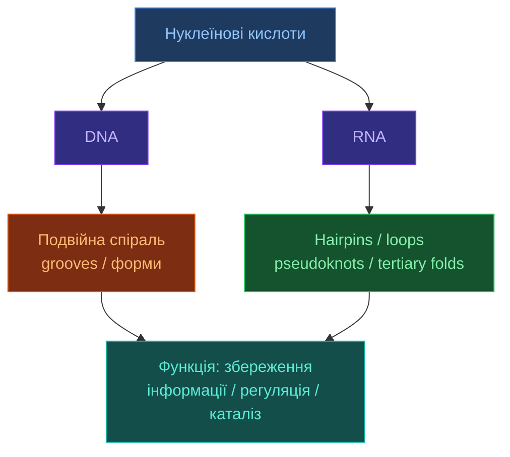

# Нуклеїнові кислоти

[[UA/Головна]] > [[UA/Індекс|Концепції]] > Біологія
🇬🇧 [[EN/2. Concepts/2.1. Biology/2.1.4. Nucleic Acids|English]]

> **Нуклеїнові кислоти** — це не лише носії генетичної інформації. Їхня функція визначається поєднанням послідовності, вторинної структури, тривимірного фолдингу, іонного середовища та взаємодій із білками й лігандами.

## Чому структура нуклеїнових кислот така важлива

Для ДНК і РНК послідовність сама по собі ще не визначає біологічний ефект.
Ключовими є:

- просторова укладка ланцюга;
- доступність борозенок, петель і мотивів;
- здатність до комплементарного спарювання;
- зв'язування з білками, іонами та малими молекулами.

Саме тому одна й та сама послідовність у різних середовищах може поводитися по-різному, а prediction для ДНК/РНК часто складніший, ніж для globular proteins.

## Базова хімічна логіка

Кожен нуклеотид складається з:

- азотистої основи;
- цукру;
- фосфатної групи.

Різниця між ДНК і РНК починається вже на рівні цукру:

- ДНК має `2'-deoxyribose`;
- РНК має `ribose` з `2'-OH`, що підвищує хімічну реактивність і структурну гнучкість.

## ДНК проти РНК

| Властивість | ДНК | РНК |
| --- | --- | --- |
| Цукор | 2'-дезоксирибоза | Рибоза |
| Основа | A, T, G, C | A, U, G, C |
| Типова організація | Часто дволанцюгова | Часто одноланцюгова |
| Типова геометрія | B-форма | A-подібна локальна геометрія |
| Стабільність | Вища | Нижча через 2'-OH |
| Типові ролі | Збереження інформації | Інформація, регуляція, каталіз |

## Ієрархія структури

### ДНК

Для ДНК важливі:

- подвійна спіраль;
- major і minor grooves;
- альтернативні форми (`A-DNA`, `B-DNA`, `Z-DNA`);
- локальні деформації на місцях зв'язування білків.

### РНК

Для РНК особливо важливі:

- вторинні мотиви;
- tertiary contacts;
- участь іонів, зокрема `Mg2+`;
- псевдовузли та інші неканонічні патерни спарювання.

## Вторинна структура РНК

У наближених енергетичних моделях folding РНК часто описують як суму внесків стекінгу й петель:

$$\Delta G_\text{fold}^{\text{RNA}} = \sum_i \Delta G_i^{\text{stack}} + \sum_j \Delta G_j^{\text{loop}} + \Delta G^{\text{init}}$$

Типові мотиви:

- `hairpin / stem-loop`;
- `bulge`;
- `internal loop`;
- `junction`;
- `pseudoknot`.

Ці мотиви є функціонально важливими для riboswitches, tRNA, ribozymes і багатьох регуляторних РНК.

## Неканонічні взаємодії

На відміну від спрощеної схеми `A-U` і `G-C`, реальні РНК мають великий клас неканонічних base pairs і tertiary contacts.
Саме вони часто створюють:

- каталіз;
- специфічне білок-РНК розпізнавання;
- складний 3D-фолд.

Тому prediction для РНК погано зводиться лише до простого Watson-Crick pairing.

## Чому нуклеїнові кислоти складні для ML-моделей

- **Менше високоякісних структурних даних**, ніж для білків.
- **Вища конформаційна пластичність**, особливо для РНК.
- **Сильна залежність від середовища**: іони, pH, ліганди, білки.
- **Неканонічні контакти** часто важливіші, ніж у простих sequence-based уявленнях.
- **MSA-сигнал** для РНК/ДНК часто менш прямолінійний, ніж для білкових сімейств.

## AlphaFold 3 і нуклеїнові кислоти

AF3 важливий тим, що включає нуклеїнові кислоти не як побічний випадок, а як одну з базових сутностей unified biomolecular modeling.
Практично це означає:

- моделювання `protein-DNA` і `protein-RNA` комплексів;
- роботу зі змішаними системами `protein + nucleic acid + ligand`;
- ширший coverage порівняно з protein-centric підходами попереднього покоління.

Водночас РНК лишається одним із найскладніших режимів через високу гнучкість і складну фізику tertiary packing.

## Споріднені підходи й методи

| Підхід | Що моделює | Типова сила | Типове обмеження |
| --- | --- | --- | --- |
| [[UA/1. AlphaFold3/1.2. Архітектура/1.2.1. Загальна архітектура AF3]] | Загальні біомолекулярні комплекси | Єдина модель для mixed systems | Складні режими РНК лишаються важкими |
| РНК secondary structure prediction | Парування й локальні мотиви | Добре для stem-loop логіки | Слабше для повного 3D |
| RNA tertiary modeling | 3D-фолд РНК | Кращий фокус на РНК-геометрії | Менший універсалізм |
| Protein-DNA / protein-RNA docking | Інтерфейс взаємодії | Добре для спеціалізованих задач | Часто не universal end-to-end |

## Пов'язані нотатки

- [[UA/2. Концепції/2.1. Біологія/2.1.1. Згортання білків|Згортання білків]]
- [[UA/2. Концепції/2.3. Структурна-Біоінформатика/2.3.4. MSA|MSA]]
- [[UA/1. AlphaFold3/1.3. Результати/1.3.1. Точність по типах комплексів|Точність по типах комплексів]]
- [[UA/1. AlphaFold3/1.4. Обмеження/1.4.1. Обмеження моделі|Обмеження моделі]]

> Watson and Crick (1953). *Molecular structure of nucleic acids*. Nature.
> DOI: [10.1038/171737a0](https://doi.org/10.1038/171737a0)

> Leontis and Westhof (2001). *Geometric nomenclature and classification of RNA base pairs*. RNA.
> DOI: [10.1017/S1355838201002515](https://doi.org/10.1017/S1355838201002515)

> Abramson et al. (2024). *Accurate structure prediction of biomolecular interactions with AlphaFold 3*. Nature.
> DOI: [10.1038/s41586-024-07487-w](https://doi.org/10.1038/s41586-024-07487-w)
