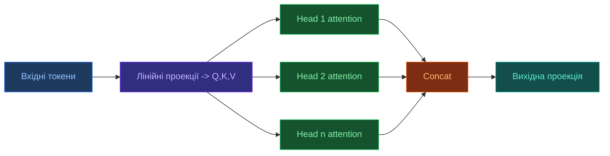
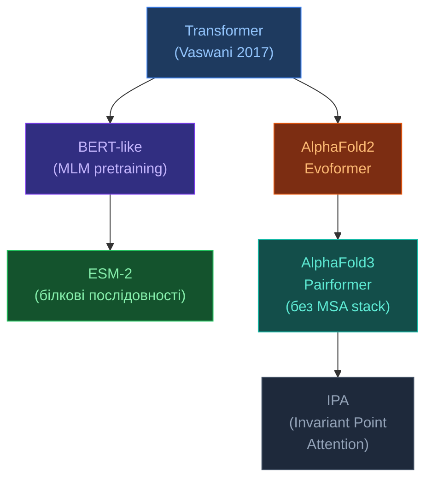

<!-- markdownlint-disable MD013 -->

# Трансформери в структурній біології

[[UA/Головна]] > [[UA/Індекс|Концепції]] > Машинне навчання
🇬🇧 [[EN/2. Concepts/2.2. Machine-Learning/2.2.1. Transformers|English]]

> **Трансформер** — архітектура нейромережі на основі механізму уваги (attention). У структурній біології замінив рекурентні мережі завдяки паралелізму та здатності моделювати далекі взаємодії.

---

## Механізм уваги

### Self-Attention

$$\text{Attention}(Q,K,V) = \text{softmax}\!\left(\frac{QK^\top}{\sqrt{d_k}}\right)V$$

де $Q = XW_Q$, $K = XW_K$, $V = XW_V$ — лінійні проекції входу $X$.

### Multi-Head Attention (MHA)

$$\text{MHA}(X) = \text{Concat}(\text{head}_1,\ldots,\text{head}_h)\,W_O$$

$$\text{head}_i = \text{Attention}(XW_Q^i,\,XW_K^i,\,XW_V^i)$$

Складність: $O(N^2 d)$ — квадратична по довжині послідовності.

## Навіщо потрібен Attention (обґрунтування)

### Проблема RNN/CNN для біомолекул

- `RNN` (рекурентні мережі) — довгий шлях градієнта між далекими позиціями послідовності.
- `CNN` (згорткові мережі) — локальне receptive field, для далеких контактів треба багато шарів.
- У білках критичні далекі контакти: залишки, розділені сотнями позицій у послідовності, можуть бути сусідами в 3D.

### Ідея Attention

Кожна позиція $i$ одразу "дивиться" на всі позиції $j$ через ваги схожості:

$$s_{ij} = \frac{q_i^\top k_j}{\sqrt{d_k}}, \qquad
\alpha_{ij} = \frac{\exp(s_{ij})}{\sum_{m=1}^{N}\exp(s_{im})}, \qquad
y_i = \sum_{j=1}^{N}\alpha_{ij}v_j$$

Це дає короткий шлях взаємодії між будь-якими двома токенами (1 крок у графі уваги).

### Чому ділення на $\sqrt{d_k}$

Без масштабування скалярні добутки $q_i^\top k_j$ ростуть із розмірністю $d_k$, `softmax` насичується, градієнти стають малими.
Масштабування стабілізує розподіл логітів і тренування.

## Приклад (інтуїтивний)

Нехай токен `i` відповідає залишку 35, а токен `j` — залишку 182.
У послідовності вони далекі, але в 3D можуть утворювати контакт (наприклад, у ядрі білка).
Attention може дати високу вагу $\alpha_{35,182}$, навіть якщо між ними 147 позицій у первинній структурі.

Малий числовий приклад для одного query:

$$s=[1.2,\;0.1,\;2.0], \qquad \alpha=\text{softmax}(s)\approx[0.28,\;0.09,\;0.63]$$

Отже третій токен найбільше впливає на вихід.



## Приклад реалізації на PyTorch

Нижче мінімальна реалізація `scaled dot-product attention` та `multi-head self-attention`.

```python
import torch
import torch.nn as nn
import torch.nn.functional as F


def scaled_dot_product_attention(q, k, v, mask=None, dropout_p=0.0, training=False):
    """
    q, k, v: [batch, heads, seq_len, head_dim]
    mask: broadcastable to [batch, heads, seq_len, seq_len]
          values: 1 for keep, 0 for block
    """
    d_k = q.size(-1)
    scores = torch.matmul(q, k.transpose(-2, -1)) / (d_k ** 0.5)

    if mask is not None:
        scores = scores.masked_fill(mask == 0, float("-inf"))

    attn = F.softmax(scores, dim=-1)
    attn = F.dropout(attn, p=dropout_p, training=training)
    out = torch.matmul(attn, v)
    return out, attn


class MultiHeadSelfAttention(nn.Module):
    def __init__(self, d_model: int, num_heads: int, dropout: float = 0.1):
        super().__init__()
        assert d_model % num_heads == 0, "d_model must be divisible by num_heads"
        self.d_model = d_model
        self.num_heads = num_heads
        self.head_dim = d_model // num_heads

        self.q_proj = nn.Linear(d_model, d_model)
        self.k_proj = nn.Linear(d_model, d_model)
        self.v_proj = nn.Linear(d_model, d_model)
        self.out_proj = nn.Linear(d_model, d_model)
        self.dropout = dropout

    def _split_heads(self, x):
        # x: [batch, seq_len, d_model] -> [batch, heads, seq_len, head_dim]
        bsz, seq_len, _ = x.shape
        x = x.view(bsz, seq_len, self.num_heads, self.head_dim)
        return x.transpose(1, 2)

    def _merge_heads(self, x):
        # x: [batch, heads, seq_len, head_dim] -> [batch, seq_len, d_model]
        bsz, _, seq_len, _ = x.shape
        x = x.transpose(1, 2).contiguous()
        return x.view(bsz, seq_len, self.d_model)

    def forward(self, x, mask=None, return_attn=False):
        q = self._split_heads(self.q_proj(x))
        k = self._split_heads(self.k_proj(x))
        v = self._split_heads(self.v_proj(x))

        context, attn = scaled_dot_product_attention(
            q, k, v, mask=mask, dropout_p=self.dropout, training=self.training
        )
        out = self.out_proj(self._merge_heads(context))
        if return_attn:
            return out, attn
        return out


if __name__ == "__main__":
    torch.manual_seed(7)
    x = torch.randn(2, 128, 256)  # [batch, seq_len, d_model]
    mha = MultiHeadSelfAttention(d_model=256, num_heads=8, dropout=0.1)
    y, attn = mha(x, return_attn=True)
    print("output:", y.shape)      # [2, 128, 256]
    print("attn:", attn.shape)     # [2, 8, 128, 128]
```

## Стандартний трансформер vs біологічні варіанти



## Pairformer в AlphaFold 3

Pairformer — ключова зміна AF3 проти AF2 (де був Evoformer).

### Що змінилось

| Компонент | AlphaFold 2 (Evoformer) | AlphaFold 3 (Pairformer) |
|-----------|------------------------|--------------------------|
| MSA обробка | 48 блоків MSA + pair | 4 блоки MSA + **48 блоків pair** |
| Основний фокус | MSA → pair | pair (парні взаємодії) |
| Нові типи молекул | Тільки білки | Білки + ДНК + РНК + ліганди |
| Pair attention | Row/column-wise | **Pair bias + triangle updates** |

### Pair Representation Update

$$z_{ij} \leftarrow z_{ij} + \text{TriangleAtt}(z) + \text{TriangleMult}(z) + \text{Transition}(z)$$

Triangle attention моделює геометрію: якщо $i$–$j$ і $j$–$k$ взаємодіють, то $i$–$k$ теж має бути пов'язані (трикутна нерівність у структурному просторі).

## Invariant Point Attention (IPA)

IPA — attention у $SE(3)$-еквіваріантному просторі, що використовується у дифузійному модулі AF3:

$$a_{ij} = \text{softmax}\!\left(\frac{q_i^\top k_j}{d} + b_{ij} - \frac{\gamma}{2}\sum_p \bigl\|T_i\mathbf{q}_i^p - T_j\mathbf{k}_j^p\bigr\|^2\right)$$

де $T_i = (R_i, \mathbf{t}_i) \in SE(3)$ — рамка залишку $i$, $\mathbf{q}_i^p$ — точкові запити в локальній системі.

IPA **інваріантна** до глобального обертання/зміщення системи.


## LoRA для адаптації трансформерів

`LoRA` (Low-Rank Adaptation) не змінює напряму повну матрицю ваг $W$, а додає до неї навчуване low-rank оновлення:

$$W' = W + \Delta W, \qquad \Delta W = \frac{\alpha}{r}BA$$

де $W \in \mathbb{R}^{d_{\text{in}}\times d_{\text{out}}}$, $B \in \mathbb{R}^{d_{\text{in}}\times r}$, $A \in \mathbb{R}^{r\times d_{\text{out}}}$, а $r \ll \min(d_{\text{in}}, d_{\text{out}})$.

### Чому це можливо

- Для великих трансформерів корисні fine-tuning оновлення часто мають низький ефективний ранг.
- Найбільше параметрів зосереджено в лінійних проекціях attention та MLP-блоків.
- Багато downstream-задач потребують не повного переписування моделі, а керованого зсуву вже наявних ознак.

### Типові точки вставки

| Сімейство трансформерів | Куди зазвичай ставлять LoRA | Типова мета |
|---|---|---|
| Decoder-only LLM | `q_proj`, `k_proj`, `v_proj`, `o_proj`, up/down проекції MLP | instruction tuning, доменна адаптація |
| Encoder або encoder-decoder transformer | attention-проекції та feed-forward шари | класифікація, retrieval, translation |
| Protein transformer / pLM | attention-проекції, інколи вихідний MLP | спеціалізація на біодомені |

### Чому це важливо

- Навчуваними лишаються лише мала частка параметрів.
- Один базовий checkpoint можна перевикористовувати для багатьох задач.
- Адаптери невеликі, тому їх зручно перемикати між доменами або задачами.
- У поєднанні з low-bit frozen weights (`QLoRA`) вимоги до пам'яті ще нижчі.

### Обмеження

- Надто малий rank може дати underfitting при великому зсуві домену.
- Якщо вузьке місце моделі — це контекстне вікно, токенізація або слабка базова модель, LoRA цього не виправить.
- Обслуговування великої кількості task-specific адаптерів додає операційної складності.

## Quantization для inference і tuning трансформерів

Квантування (`quantization`) зберігає ваги або активації у нижчій точності:

$$q = \mathrm{round}\!\left(\frac{w}{s}\right) + z,
\qquad
w \approx s(q-z)$$

де $s$ — scale, а $z$ — zero-point для асиметричних схем.

### Основні підходи

| Підхід | Що квантується | Типовий режим | Сильна сторона | Компроміс |
|---|---|---|---|---|
| PTQ | ваги після навчання | `INT8`, `INT4` | не треба перевчати модель | якість залежить від калібрування |
| QAT | ваги й активації під час навчання | `INT8` або нижче | найкраще тримає якість | найдорожчий в реалізації |
| Weight-only quantization | переважно ваги | `W4A16`, `W8A16` | сильна економія пам'яті, простіший inference | активації й `KV cache` лишаються дорогими |
| `QLoRA` | frozen base weights + LoRA adapters | зазвичай 4-bit база + BF16 адаптери | дешевший fine-tuning | спеціалізованіший train pipeline |

### Особливості саме для трансформерів

- В attention є outlier-канали, які непропорційно збільшують quantization error.
- Для long-context serving обмеженням часто стає не лише вага моделі, а й `KV cache`.
- Weight-only `INT4` часто практичний для inference, тоді як повне activation quantization складніше стабілізувати для довгого декодування.
- Методи на кшталт `GPTQ` та `AWQ` намагаються зберегти найчутливіші канали або напрями реконструкції.

### Практичне правило

- Повний fine-tuning потрібен, коли базову модель треба суттєво переписати.
- `LoRA` підходить, коли потрібен легкий task-specific адаптер.
- `QLoRA` варто брати, коли головне обмеження під час навчання — пам'ять GPU.
- `GPTQ`/`AWQ`-подібне PTQ доцільне, коли основна ціль — дешевший inference.

> Vaswani et al. (2017). *Attention Is All You Need*. NeurIPS.
> DOI: [10.48550/arXiv.1706.03762](https://doi.org/10.48550/arXiv.1706.03762)
> Jumper et al. (2021). *AlphaFold2*. Nature 596.
> DOI: [10.1038/s41586-021-03819-2](https://doi.org/10.1038/s41586-021-03819-2)
> Hu et al. (2021). *LoRA: Low-Rank Adaptation of Large Language Models*. arXiv.
> DOI: [10.48550/arXiv.2106.09685](https://doi.org/10.48550/arXiv.2106.09685)
> Frantar et al. (2022). *GPTQ: Accurate Post-Training Quantization for Generative Pre-trained Transformers*. arXiv.
> DOI: [10.48550/arXiv.2210.17323](https://doi.org/10.48550/arXiv.2210.17323)
> Lin et al. (2023). *AWQ: Activation-aware Weight Quantization for LLM Compression and Acceleration*. MLSys.
> DOI: [10.48550/arXiv.2306.00978](https://doi.org/10.48550/arXiv.2306.00978)
> Dettmers et al. (2023). *QLoRA: Efficient Finetuning of Quantized LLMs*. NeurIPS.
> DOI: [10.48550/arXiv.2305.14314](https://doi.org/10.48550/arXiv.2305.14314)

---

## Пов'язані нотатки

- [[UA/1. AlphaFold3/1.2. Архітектура/1.2.2. Pairformer]]
- [[UA/2. Концепції/2.2. Машинне-Навчання/2.2.4. Геометричне глибоке навчання]]
- [[UA/2. Концепції/2.2. Машинне-Навчання/2.2.3. Білкові мовні моделі]]
- [[UA/2. Концепції/2.2. Машинне-Навчання/2.2.2. Дифузійні моделі]]
