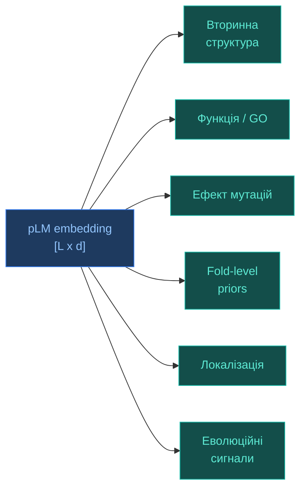

# Білкові мовні моделі (pLM)

[[UA/Головна]] > [[UA/Індекс|Концепції]] > Машинне навчання
🇬🇧 [[EN/2. Concepts/2.2. Machine-Learning/2.2.3. Protein Language Models|English]]

> **Білкова мовна модель** (`protein language model`, `pLM`) навчається на великих корпусах білкових послідовностей без ручної розмітки і вчиться передбачати контекст амінокислот. Через це вона засвоює статистичні закономірності, які відображають еволюційні, біофізичні й частково структурні обмеження.

---

## Чому це взагалі можливо?

Ідея pLM працює не тому, що білок є "текстом" у буквальному сенсі, а тому, що білкові послідовності не є випадковими рядками.

### 1. Послідовності обмежені фізикою та еволюцією

Функціональний білок повинен:

- згортатися у стабільну 3D-структуру;
- зберігати сумісні фізико-хімічні властивості залишків;
- проходити еволюційний відбір;
- часто зберігати мотиви, активні сайти та інтерфейсні патерни.

Отже, натуральні білки займають не весь простір можливих послідовностей, а лише вузький підпростір допустимих рішень.

### 2. Контекст несе біологічний сигнал

Імовірність побачити амінокислоту в позиції $i$ залежить від сусідніх і далеких позицій:

$$p(x_i \mid x_{\setminus i})$$

або в авторегресивному формулюванні:

$$p(x)=\prod_{i=1}^{L} p(x_i \mid x_{<i})$$

Якщо модель добре відновлює замасковані або наступні залишки, вона вимушено вчиться кодувати:

- локальні мотиви;
- далекі залежності;
- сімейну подібність;
- сигнали, пов'язані зі структурою та функцією.

### 3. Масштаб даних компенсує відсутність розмітки

Структурних і функціональних міток відносно мало, зате відомих послідовностей дуже багато.
Self-supervised навчання дозволяє використати цей дисбаланс на користь моделі: pLM вчиться на "сирих" послідовностях, а вже потім її репрезентації використовують у downstream-задачах.

### 4. Еволюція залишає статистичний слід

Якщо різні амінокислотні заміни багаторазово з'являються у схожих структурних або функціональних контекстах, модель починає узагальнювати ці закономірності.
Саме тому embeddings часто несуть інформацію про fold, консервативність, mutation effect і навіть про деякі аспекти функції.

## Від NLP до білків

Аналогія з NLP корисна, але неповна.

| NLP | Білки |
| --- | --- |
| Токени | Амінокислоти або підпослідовності |
| Контекст слова | Послідовнісний та еволюційний контекст |
| Граматика | Біофізичні та еволюційні обмеження |
| Семантика | Структура, функція, взаємодії |
| Маскований токен | Замаскований залишок |

Ключова різниця: у білках "значення" послідовності реалізується через 3D-структуру, динаміку та взаємодії, а не лише через лінійний контекст.

## Основні підходи

### 1. `Autoregressive` — авторегресивні моделі

Модель читає послідовність зліва направо й оцінює:

$$p(x)=\prod_{i=1}^{L} p(x_i \mid x_{<i})$$

Переваги:

- природні для генерації нових послідовностей;
- зручні для conditional design після fine-tuning.

Обмеження:

- слабше бачать двобічний контекст, ніж bidirectional-моделі;
- часто менш зручні як універсальний encoder для residue-level задач.

Приклади:

- `UniRep`;
- `ProtGPT2`;
- `ProGen`.

### 2. `Masked language modeling` — масковані bidirectional-моделі

Модель отримує послідовність із замаскованими позиціями й відновлює приховані залишки:

$$\mathcal{L}_{\mathrm{MLM}}=-\mathbb{E}\left[\log p_\theta(x_i \mid x_{\setminus i})\right]$$

Переваги:

- використовують контекст з обох боків;
- дають сильні embeddings для класифікації, локалізації та mutation scoring.

Приклади:

- `ESM-1 / ESM-2`;
- `ProtBert`;
- `ProtT5`.

### 3. `MSA-aware` — моделі, що працюють із множинним вирівнюванням

Тут вхід не одна послідовність, а `multiple sequence alignment` (`MSA`).
Такі моделі вчаться одночасно по рядках і стовпцях вирівнювання, поєднуючи переваги pLM і класичного еволюційного сигналу.

Переваги:

- сильніше захоплюють коеволюцію;
- особливо корисні для контактів і структури.

Обмеження:

- вимагають MSA, тобто не повністю `single-sequence`;
- дорожчі на практиці.

Приклад:

- `MSA Transformer`.

### 4. `Protein-specific multitask` — білково-специфічні multitask-підходи

Деякі моделі не обмежуються чистим MLM, а додають білково-специфічні цілі.
Наприклад, `ProteinBERT` поєднує мовне моделювання з prediction на рівні білка, зокрема для функціональних анотацій.

Переваги:

- краще узгоджують локальні й глобальні ознаки;
- корисні для задач функції та анотації.

### 5. `Sequence-to-structure coupled` — моделі, зв'язані зі структурним передбаченням

Є окремий клас систем, де pLM слугує encoder-основою для подальшого передбачення структури.
Найвідоміший приклад: `ESMFold`, який будує структуру з single-sequence сигналу без повного MSA-пайплайну.

## Що саме кодують pLM-embeddings?

Embeddings не є "готовою структурою", але вони часто кодують ознаки, корисні для:

- вторинної структури;
- solvent exposure;
- subcellular localization;
- family membership;
- residue importance;
- mutation effect prediction;
- грубих fold-level priors.

Глибинна причина в тому, що модель стискає вектором інформацію, потрібну для передбачення контексту.
А контекст у білках визначається не лише локальною послідовністю, а й структурними та функціональними обмеженнями.

## Властивості pLM

- **Self-supervised масштабованість**: можна вчитися на гігантських базах без ручної розмітки.
- **Transfer learning**: одна pretrained-модель може бути основою для великого набору downstream-задач.
- **Single-sequence режим**: багато pLM корисні навіть без MSA, що важливо для рідкісних або нових послідовностей.
- **Zero-shot можливості**: деякі моделі можуть оцінювати мутації без окремого донавчання на конкретному білку.
- **Універсальність представлень**: один embedding придатний і для residue-level, і для protein-level задач.
- **Сумісність із іншими модальностями**: pLM embeddings добре поєднуються зі структурними, графовими та геометричними моделями.

## Обмеження

- **Послідовність не дорівнює повному механізму**: pLM бачить лише sequence-space і не має явної фізичної моделі енергії, розчинника чи кінетики.
- **Слабший контроль над multimer / ligand context**: sequence-only моделі часто гірше враховують міжланцюгові та ligand-dependent ефекти.
- **Біас даних**: навчальні бази нерівномірно покривають білковий простір, тому модель краще знає часті сімейства, ніж рідкісні.
- **Quadratic attention cost**: для довгих послідовностей повний attention дорогий за пам'яттю та часом.
- **Нееквівалентність до причинного знання**: добра репрезентація не означає, що модель "розуміє" біохімію у механістичному сенсі.
- **Генерація не гарантує функціональність**: навіть правдоподібна з погляду pLM послідовність потребує структурної та експериментальної валідації.

## Інші подібні підходи та методи

Нижче наведено не лише "класичні" pLM, а й близькі підходи, які часто стоять поруч у практичних пайплайнах.

| Підхід / метод | Тип | Що робить | Приклади |
| --- | --- | --- | --- |
| `Single-sequence pLM` | sequence-only pretraining | Вчить embeddings із сирих послідовностей | ESM-2, ProtT5 |
| `MSA-based models` | family-aware sequence modeling | Використовує коеволюцію через вирівнювання | [[UA/2. Концепції/2.3. Структурна-Біоінформатика/2.3.4. MSA]], MSA Transformer |
| `Generative pLM` | sequence generation | Генерує нові білкові послідовності | ProGen, ProtGPT2 |
| `pLM + structure head` | sequence-to-structure | Будує 3D-структуру з embeddings | ESMFold |
| `Inverse folding` | structure-conditioned design | Генерує послідовність під задану структуру | ProteinMPNN |
| `Geometric models` | structure-native learning | Працює напряму з 3D-геометрією | EGNN, SE(3)-моделі |

### Короткі кейси важливих сімейств

- **`ProtTrans`**:
  велике сімейство моделей (`BERT`, `T5`, `XLNet`) для білкових послідовностей; показало, що самі embeddings уже корисні для структури, локалізації й мембранності.
- **`ProteinBERT`**:
  приклад білково-специфічного дизайну, де локальні та глобальні представлення вчаться разом.
- **`MSA Transformer`**:
  міст між pLM і класичним evolutionary modeling.
- **`ESM-2`**:
  сильний bidirectional transformer-encoder для універсальних білкових embeddings.
- **`ESMFold`**:
  приклад того, як pLM може бути ядром single-sequence structure prediction.
- **`ProGen` / `ProtGPT2`**:
  генеративні моделі для de novo sequence design.
- **`ProteinMPNN`**:
  не класична pLM, але дуже важливий сусідній метод для sequence design із уже відомої структури.

## pLM у ширшому контексті AlphaFold-подібних систем

Для задач структурної біології pLM важливі з двох причин:

- вони дають сильний `single-sequence prior`, коли MSA слабке або дороге;
- вони можуть бути попереднім джерелом ознак для структурних і геометричних моделей.

Тобто pLM не замінюють усю структурну біологію, але істотно зменшують залежність від ручних ознак і дорогого evolutionary preprocessing у частині сценаріїв.

## Пов'язані нотатки

- [[UA/2. Концепції/2.2. Машинне-Навчання/2.2.1. Трансформери|Трансформери]]
- [[UA/2. Концепції/2.3. Структурна-Біоінформатика/2.3.4. MSA|MSA]]
- [[UA/2. Концепції/2.2. Машинне-Навчання/2.2.4. Геометричне глибоке навчання|Геометричне глибоке навчання]]
- [[UA/1. AlphaFold3/1.2. Архітектура/1.2.1. Загальна архітектура AF3|Загальна архітектура AF3]]

> Rao et al. (2019). *Evaluating Protein Transfer Learning with TAPE*. NeurIPS.
> DOI: [10.48550/arXiv.1906.08230](https://doi.org/10.48550/arXiv.1906.08230)

> Rives et al. (2021). *Biological structure and function emerge from scaling unsupervised learning to 250 million protein sequences*. PNAS.
> DOI: [10.1073/pnas.2016239118](https://doi.org/10.1073/pnas.2016239118)

> Rao et al. (2021). *MSA Transformer*. ICML.
> DOI: [10.48550/arXiv.2104.02180](https://doi.org/10.48550/arXiv.2104.02180)

> Elnaggar et al. (2022). *ProtTrans: Toward Understanding the Language of Life Through Self-Supervised Learning*. IEEE TPAMI.
> DOI: [10.1109/TPAMI.2021.3095381](https://doi.org/10.1109/TPAMI.2021.3095381)

> Brandes et al. (2022). *ProteinBERT: a universal deep-learning model of protein sequence and function*. Bioinformatics.
> DOI: [10.1093/bioinformatics/btac020](https://doi.org/10.1093/bioinformatics/btac020)

> Meier et al. (2021). *Language models enable zero-shot prediction of the effects of mutations on protein function*. NeurIPS.
> DOI: [10.48550/arXiv.2107.04680](https://doi.org/10.48550/arXiv.2107.04680)

> Lin et al. (2023). *Evolutionary-scale prediction of atomic-level protein structure with a language model*. Science.
> DOI: [10.1126/science.ade2574](https://doi.org/10.1126/science.ade2574)

> Madani et al. (2023). *Large language models generate functional protein sequences across diverse families*. Nature Biotechnology.
> DOI: [10.1038/s41587-022-01618-2](https://doi.org/10.1038/s41587-022-01618-2)

> Ferruz et al. (2022). *ProtGPT2 is a deep unsupervised language model for protein design*. Nature Communications.
> DOI: [10.1038/s41467-022-32007-7](https://doi.org/10.1038/s41467-022-32007-7)

> Alley et al. (2019). *Unified rational protein engineering with sequence-based deep representation learning*. Nature Methods.
> DOI: [10.1038/s41592-019-0598-1](https://doi.org/10.1038/s41592-019-0598-1)

> Dauparas et al. (2022). *Robust deep learning-based protein sequence design using ProteinMPNN*. Science.
> DOI: [10.1126/science.add2187](https://doi.org/10.1126/science.add2187)
