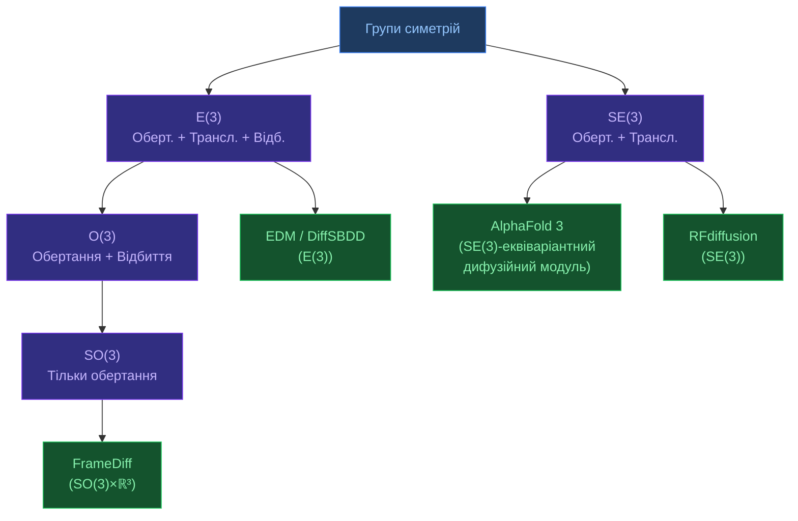

# Геометричне глибоке навчання

[[🏠 Головна]] > [[UA/2.0. Індекс|Концепції]] > Машинне навчання
🇬🇧 [[EN/2. Concepts/2.2. Machine-Learning/2.2.4. Geometric Deep Learning|English]]

> **Геометричне глибоке навчання** (GDL) — підхід, що вбудовує геометричні симетрії безпосередньо в архітектуру нейромережі. Ключовий принцип: модель повинна **поважати** симетрії задачі.

---

## Симетрії в молекулярному моделюванні

Молекулярна структура **не залежить** від:
- **Трансляції** — де знаходиться молекула в просторі
- **Обертання** — як орієнтована молекула
- **Відбиття** (для деяких задач)

Ці симетрії утворюють групу $E(3)$ (або $SE(3)$ без відбиттів).

## Інваріантність vs Еквіваріантність

$$f(Tx) = f(x) \quad \text{(інваріантність)}$$

$$f(Tx) = T\cdot f(x) \quad \text{(еквіваріантність)}$$

де $T$ — перетворення симетрії.

| Тип | Що це | Приклад |
|-----|-------|---------|
| **Інваріантний вихід** | Скаляр, незалежний від орієнтації | Енергія, pLDDT |
| **Еквіваріантний вихід** | Вектор/тензор, що обертається разом | Координати, сили |

## Групи симетрій у біомолекулярному ML

## Графові нейромережі (GNN) для молекул

Молекула як граф: атоми — вузли, зв'язки — ребра.

$$\mathbf{h}_i^{(l+1)} = \phi\!\left(\mathbf{h}_i^{(l)},\,\bigoplus_{j\in\mathcal{N}(i)} \psi\!\bigl(\mathbf{h}_i^{(l)}, \mathbf{h}_j^{(l)}, \mathbf{e}_{ij}\bigr)\right)$$

де $\bigoplus$ — агрегація (sum, mean, max), $\phi, \psi$ — learnable функції.

**Проблема**: стандартні GNN не $E(3)$-еквіваріантні — різні орієнтації молекули дають різні відповіді!

## SE(3)-Transformer та EGNN

**EGNN** (Equivariant GNN) — еквіваріантне оновлення координат:

$$\mathbf{x}_i^{(l+1)} = \mathbf{x}_i^{(l)} + \sum_{j\neq i} (\mathbf{x}_i^{(l)} - \mathbf{x}_j^{(l)})\cdot\phi_x(m_{ij})$$

де $m_{ij}$ — message від атома $j$ до $i$, що залежить лише від $\|\mathbf{x}_i - \mathbf{x}_j\|$ (інваріант).

> Satorras et al. (2021). *E(n) Equivariant Graph Neural Networks*. ICML.
> DOI: [10.48550/arXiv.2102.09844](https://doi.org/10.48550/arXiv.2102.09844)

## AlphaFold 3 і геометрична еквіваріантність

AF3 досягає $SE(3)$-еквіваріантності через:

1. **IPA (Invariant Point Attention)** — attention з точками у локальних рамках $T_i=(R_i,\mathbf{t}_i)$:

$$a_{ij} \propto \exp\!\left(\frac{q_i^\top k_j}{d} - \frac{\gamma}{2}\sum_p \|T_i \mathbf{q}_i^p - T_j \mathbf{k}_j^p\|^2\right)$$

2. **Центрування координат** перед дифузією (видалення глобального трансляційного режиму)
3. **Augmentation**: випадкові обертання під час тренування

> Bronstein et al. (2021). *Geometric Deep Learning: Grids, Groups, Graphs, Geodesics, and Gauges*.
> DOI: [10.48550/arXiv.2104.13478](https://doi.org/10.48550/arXiv.2104.13478)

---

## Пов'язані нотатки

- [[UA/2. Концепції/2.2. Машинне-Навчання/2.2.1. Трансформери]]
- [[UA/2. Концепції/2.2. Машинне-Навчання/2.2.2. Дифузійні моделі]]
- [[UA/1. AlphaFold3/1.2. Архітектура/1.2.4. Дифузійні моделі — теорія та застосування]]
