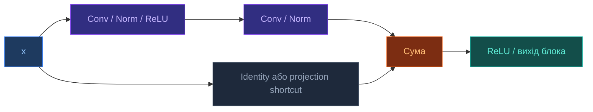

# ResNet

[[UA/Головна]] > [[UA/Індекс|Концепції]] > Машинне навчання
🇬🇧 [[EN/2. Concepts/2.2. Machine-Learning/2.2.5. ResNet|English]]

> **ResNet** (`Residual Network`) — сімейство глибоких згорткових мереж, у яких блок навчає залишкове перетворення $F(x)$ і додає його до вхідного тензора $x$. Такий обхідний шлях (`skip connection`) спрощує проходження сигналу та градієнта через дуже глибоку модель.

## Базова ідея

У звичайному CNN-шарі блок намагається напряму наблизити деяке відображення $H(x)$.
У ResNet блок вчить лише поправку до входу:

$$y = F(x; W) + x$$

де $F(x; W)$ — стек згорток, нормалізації та нелінійностей.

Якщо розмірність змінюється, shortcut роблять проєкційним:

$$y = F(x; W) + W_s x$$

Така параметризація корисна тоді, коли оптимальне відображення близьке до тотожного або відрізняється від нього лише невеликою поправкою.

## Архітектура ResNet

Типова ResNet складається з:

- `stem` на вході: велика згортка + downsampling;
- кількох `stage` з residual-блоками;
- глобального усереднення (`global average pooling`);
- фінального класифікатора.


## Residual block

Найпоширеніші два варіанти:

- `BasicBlock`:
  дві згортки `3x3`, типовий для ResNet-18/34.
- `Bottleneck`:
  `1x1 -> 3x3 -> 1x1`, типовий для ResNet-50/101/152.



## Властивості

- **Кращий градієнтний потік**: identity-шлях дає короткий маршрут для прямого та зворотного проходу.
- **Масштабованість по глибині**: ResNet дозволив стабільно тренувати значно глибші CNN, ніж у plain-архітектурах.
- **Повторне використання ознак**: блоки додають поправки до вже наявного представлення, а не щоразу перебудовують його з нуля.
- **Гнучкі варіанти**: pre-activation ResNet, Wide ResNet, ResNeXt та інші модифікації змінюють порядок нормалізації, ширину або кардинальність блоків.
- **Універсальність**: residual-дизайн став загальним патерном оптимізації не лише для CNN, а й для трансформерів, GNN та інших глибоких моделей.

## Мінімальний PyTorch-приклад

```python
import torch
import torch.nn as nn


class BasicBlock(nn.Module):
    expansion = 1

    def __init__(self, in_channels: int, out_channels: int, stride: int = 1):
        super().__init__()
        self.conv1 = nn.Conv2d(
            in_channels, out_channels, kernel_size=3, stride=stride, padding=1, bias=False
        )
        self.bn1 = nn.BatchNorm2d(out_channels)
        self.relu = nn.ReLU(inplace=True)
        self.conv2 = nn.Conv2d(
            out_channels, out_channels, kernel_size=3, stride=1, padding=1, bias=False
        )
        self.bn2 = nn.BatchNorm2d(out_channels)

        if stride != 1 or in_channels != out_channels:
            self.shortcut = nn.Sequential(
                nn.Conv2d(in_channels, out_channels, kernel_size=1, stride=stride, bias=False),
                nn.BatchNorm2d(out_channels),
            )
        else:
            self.shortcut = nn.Identity()

    def forward(self, x):
        identity = self.shortcut(x)
        out = self.relu(self.bn1(self.conv1(x)))
        out = self.bn2(self.conv2(out))
        out = out + identity
        return self.relu(out)


if __name__ == "__main__":
    x = torch.randn(2, 64, 56, 56)
    block = BasicBlock(64, 64)
    y = block(x)
    print(y.shape)  # [2, 64, 56, 56]
```

## Застосування

- **Класифікація зображень**: канонічний сценарій, з якого ResNet став стандартним backbone.
- **Detection / localization**: глибокі residual-ознаки добре працюють як основа для детекторів.
- **Semantic / instance segmentation**: encoder на базі ResNet часто використовують у сегментаційних пайплайнах.
- **Transfer learning**: попередньо навчені ResNet-моделі зручно використовувати як універсальний екстрактор ознак.

## Зв'язок з AlphaFold 3

AlphaFold 3 не є ResNet-архітектурою: його trunk побудований навколо attention, pair updates і дифузійного модуля.
Але сама ідея **residual updates** є ширшим принципом сучасного deep learning: глибокі блоки навчають поправки до представлення, що полегшує оптимізацію й стабілізує тренування.

## Пов'язані нотатки

- [[UA/2. Концепції/2.2. Машинне-Навчання/2.2.1. Трансформери|Трансформери]]
- [[UA/2. Концепції/2.2. Машинне-Навчання/2.2.4. Геометричне глибоке навчання|Геометричне глибоке навчання]]
- [[UA/1. AlphaFold3/1.2. Архітектура/1.2.2. Pairformer|Pairformer]]

> He et al. (2016). *Deep Residual Learning for Image Recognition*. CVPR.
> DOI: [10.1109/CVPR.2016.90](https://doi.org/10.1109/CVPR.2016.90)

> He et al. (2016). *Identity Mappings in Deep Residual Networks*. ECCV.
> DOI: [10.48550/arXiv.1603.05027](https://doi.org/10.48550/arXiv.1603.05027)

> Zagoruyko and Komodakis (2016). *Wide Residual Networks*. BMVC.
> DOI: [10.48550/arXiv.1605.07146](https://doi.org/10.48550/arXiv.1605.07146)
