# U-Net

[[UA/Головна]] > [[UA/Індекс|Концепції]] > Машинне навчання
🇬🇧 [[EN/2. Concepts/2.2. Machine-Learning/2.2.6. U-Net|English]]

> **U-Net** — архітектура типу `encoder-decoder`, створена для щільного передбачення (`dense prediction`), насамперед для біомедичної сегментації зображень. Її ключова ідея полягає у поєднанні багатомасштабного контексту з точними локальними деталями через skip-з'єднання між симетричними рівнями стискання і розгортання.

## Базова ідея

U-Net складається з двох симетричних частин:

- `contracting path` (`encoder`) поступово зменшує просторову роздільність і збільшує кількість каналів;
- `expanding path` (`decoder`) відновлює роздільність;
- skip-з'єднання передають високодетальні ознаки з encoder у decoder.

Це дає змогу одночасно враховувати глобальний контекст і точні межі об'єктів.

## Архітектура U-Net

Типовий блок encoder виконує `Conv -> Conv -> Downsample`, а decoder виконує `Upsample -> Concat -> Conv -> Conv`.

```mermaid
flowchart LR
    IN["Вхідне зображення / карта ознак"]:::input --> E1["Encoder 1<br/>Conv + Conv"]:::trunk
    E1 --> D1["Downsample"]:::neutral
    D1 --> E2["Encoder 2<br/>Conv + Conv"]:::trunk
    E2 --> D2["Downsample"]:::neutral
    D2 --> B["Bottleneck"]:::diffusion
    B --> U2["Upsample"]:::neutral
    E2 --> S2["Skip features"]:::confidence
    U2 --> C2["Concat"]:::confidence
    S2 --> C2
    C2 --> DEC2["Decoder 2<br/>Conv + Conv"]:::trunk
    DEC2 --> U1["Upsample"]:::neutral
    E1 --> S1["Skip features"]:::confidence
    U1 --> C1["Concat"]:::confidence
    S1 --> C1
    C1 --> DEC1["Decoder 1<br/>Conv + Conv"]:::trunk
    DEC1 --> OUT["Сегментаційна маска / dense output"]:::output

    classDef input fill:#1e3a5f,stroke:#3b82f6,color:#93c5fd
    classDef trunk fill:#312e81,stroke:#7c3aed,color:#c4b5fd
    classDef diffusion fill:#14532d,stroke:#22c55e,color:#86efac
    classDef confidence fill:#7c2d12,stroke:#ea580c,color:#fdba74
    classDef output fill:#134e4a,stroke:#14b8a6,color:#5eead4
    classDef neutral fill:#1e293b,stroke:#475569,color:#94a3b8
```



## Ключовий блок

У спрощеному вигляді decoder-рівень можна записати так:

$$u_l = \mathrm{Up}(h_{l+1}), \qquad
c_l = \mathrm{Concat}(u_l, s_l), \qquad
h_l = f_l(c_l)$$

де:

- $h_{l+1}$ — глибше представлення;
- $s_l$ — skip-ознаки з encoder;
- $\mathrm{Up}$ — upsampling або transpose convolution;
- $f_l$ — локальний стек згорток.

## Властивості

- **Багатомасштабність**: encoder збирає контекст на великих receptive fields, decoder повертає просторову деталізацію.
- **Точна локалізація**: skip-з'єднання зберігають інформацію про межі та дрібні структури.
- **Ефективність на малих датасетах**: U-Net був розроблений для біомедичних сценаріїв, де розмічених даних часто мало.
- **Гнучкість модальностей**: U-Net адаптують до 2D, 3D, мультимодальних і часових даних.
- **Сумісність із diffusion**: модифіковані U-Net-бекбони дуже поширені як денойзери в генеративних diffusion-моделях.

## Мінімальний PyTorch-приклад

```python
import torch
import torch.nn as nn


class DoubleConv(nn.Module):
    def __init__(self, in_channels: int, out_channels: int):
        super().__init__()
        self.block = nn.Sequential(
            nn.Conv2d(in_channels, out_channels, kernel_size=3, padding=1),
            nn.ReLU(inplace=True),
            nn.Conv2d(out_channels, out_channels, kernel_size=3, padding=1),
            nn.ReLU(inplace=True),
        )

    def forward(self, x):
        return self.block(x)


class MiniUNet(nn.Module):
    def __init__(self, in_channels: int = 1, out_channels: int = 1):
        super().__init__()
        self.enc1 = DoubleConv(in_channels, 32)
        self.pool = nn.MaxPool2d(2)
        self.bottleneck = DoubleConv(32, 64)
        self.up = nn.ConvTranspose2d(64, 32, kernel_size=2, stride=2)
        self.dec1 = DoubleConv(64, 32)
        self.head = nn.Conv2d(32, out_channels, kernel_size=1)

    def forward(self, x):
        skip = self.enc1(x)
        x = self.pool(skip)
        x = self.bottleneck(x)
        x = self.up(x)
        x = torch.cat([x, skip], dim=1)
        x = self.dec1(x)
        return self.head(x)


if __name__ == "__main__":
    x = torch.randn(2, 1, 128, 128)
    model = MiniUNet()
    y = model(x)
    print(y.shape)  # [2, 1, 128, 128]
```

## Застосування

- **Біомедична сегментація**: клітини, тканини, органи, пухлини, судини на мікроскопії, CT та MRI.
- **Сегментація в комп'ютерному зорі**: дороги, будівлі, дефекти матеріалів, супутникові знімки.
- **Щільні карти передбачення**: depth estimation, saliency, heatmaps, pixel-wise labeling.
- **Diffusion-моделі зображень**: U-Net-подібні мережі часто виконують роль основного денойзера.

## Зв'язок з AlphaFold 3

AlphaFold 3 не використовує класичний 2D U-Net як основний trunk.
Втім U-Net важливий у ширшому контексті сучасного deep learning, бо показує, як поєднувати багатомасштабний контекст із точним локальним відновленням, а також історично вплинув на дизайн багатьох diffusion-систем.

## Пов'язані нотатки

- [[UA/2. Концепції/2.2. Машинне-Навчання/2.2.2. Дифузійні моделі|Дифузійні моделі]]
- [[UA/2. Концепції/2.2. Машинне-Навчання/2.2.5. ResNet|ResNet]]
- [[UA/2. Концепції/2.2. Машинне-Навчання/2.2.4. Геометричне глибоке навчання|Геометричне глибоке навчання]]

> Ronneberger et al. (2015). *U-Net: Convolutional Networks for Biomedical Image Segmentation*. MICCAI.
> DOI: [10.1007/978-3-319-24574-4_28](https://doi.org/10.1007/978-3-319-24574-4_28)

> Çiçek et al. (2016). *3D U-Net: Learning Dense Volumetric Segmentation from Sparse Annotation*. MICCAI.
> DOI: [10.48550/arXiv.1606.06650](https://doi.org/10.48550/arXiv.1606.06650)

> Ho et al. (2020). *Denoising Diffusion Probabilistic Models*. NeurIPS.
> DOI: [10.48550/arXiv.2006.11239](https://doi.org/10.48550/arXiv.2006.11239)
