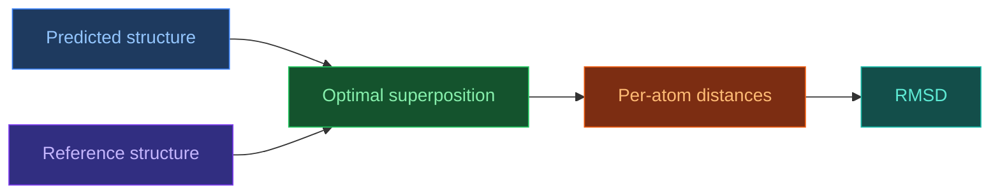

# RMSD — Root Mean Square Deviation

[[UA/Головна]] > [[UA/Індекс|Концепції]] > Структурна біоінформатика
🇬🇧 [[EN/2. Concepts/2.3. Structural-Bioinformatics/2.3.1. RMSD|English]]

> **RMSD** — одна з базових метрик структурної подібності. Вона вимірює середнє квадратичне відхилення між відповідними атомами двох структур після оптимального жорсткого суміщення.

## Навіщо потрібен RMSD

RMSD зручний тому, що дає одну інтуїтивну величину в ангстремах, яка відповідає середній просторовій похибці.
Його використовують для:

- оцінки точності prediction;
- порівняння docked poses;
- аналізу траєкторій MD;
- benchmark-оцінки structure prediction methods.

## Математичне визначення

$$\mathrm{RMSD}=\sqrt{\frac{1}{N}\sum_{i=1}^{N}\left\|\mathbf{r}_i^{\mathrm{pred}}-\mathbf{r}_i^{\mathrm{ref}}\right\|^2}$$

де:

- $N$ — кількість зіставлених атомів;
- $\mathbf{r}_i \in \mathbb{R}^3$ — координата атома.

## Чому потрібне оптимальне суміщення

Якщо структури не сумістити, RMSD змішає реальні локальні відмінності з довільними глобальними обертаннями та зсувами.
Тому перед обчисленням виконують жорстке накладання:

$$(\hat{R}, \hat{\mathbf{t}})=\arg\min_{R\in SO(3),\,\mathbf{t}} \sum_i \left\|R\mathbf{r}_i^{\mathrm{pred}}+\mathbf{t}-\mathbf{r}_i^{\mathrm{ref}}\right\|^2$$

Класичне розв'язання дає алгоритм Кабша через `SVD`.

## Поширені варіанти RMSD

| Варіант | Які атоми використовують | Коли корисний |
|---|---|---|
| `Cα RMSD` | Лише `Cα` | Швидке порівняння складки білка |
| `Backbone RMSD` | `N`, `Cα`, `C`, `O` | Глобальна геометрія backbone |
| `All-atom RMSD` | Усі важкі атоми | Детальна оцінка моделі |
| `Ligand RMSD` | Атоми ліганду | Якість docking pose |
| `Interface RMSD` | Атоми на інтерфейсі | Якість complexes |

## Практична інтерпретація

| RMSD | Типове трактування |
|---|---|
| `< 1 Å` | Майже ідеальне співпадіння |
| `1–2 Å` | Дуже добра точність |
| `2–4 Å` | Загальна форма збережена, локальні відмінності помітні |
| `> 4 Å` | Суттєва структурна розбіжність |

Для ligand docking часто використовують правило:

$$\mathrm{Ligand\ RMSD} < 2\ \text{\AA}$$

як ознаку правильної або майже правильної pose.

## Сильні сторони RMSD

- **Інтуїтивність**: значення в Å легко інтерпретувати.
- **Простота**: метрика легко обчислюється й порівнюється між роботами.
- **Універсальність**: працює для білків, лігандів, нуклеїнових кислот і комплексів.

## Обмеження RMSD

- **Чутливість до outliers**: одна погана петля може суттєво зіпсувати всю метрику.
- **Залежність від суміщення**: різні режими superposition можуть трохи змінювати оцінку.
- **Слабка локальна інтерпретованість**: одна цифра не каже, де саме помилка.
- **Залежність від розміру й типу системи**: однаковий RMSD для малого ліганду й великого білка означає різні речі.

## RMSD проти інших метрик

| Метрика | Що краще показує |
|---|---|
| [[UA/2. Концепції/2.3. Структурна-Біоінформатика/2.3.1. RMSD]] | Глобальне середнє відхилення після суміщення |
| [[UA/2. Концепції/2.3. Структурна-Біоінформатика/2.3.2. lDDT]] | Локальну якість без глобального суміщення |
| [[UA/2. Концепції/2.3. Структурна-Біоінформатика/2.3.3. DockQ]] | Якість інтерфейсу комплексу |
| `TM-score` | Fold-level similarity зі слабшою залежністю від довжини |

## TM-score як важливе доповнення

TM-score менше залежить від довжини білка й краще відображає топологічну подібність:

$$\mathrm{TM\text{-}score}=\max_{(R,t)}\left[\frac{1}{L}\sum_i \frac{1}{1+(d_i/d_0)^2}\right]$$

Через це RMSD і TM-score часто варто читати разом, а не поодинці.

## Пов'язані нотатки

- [[UA/2. Концепції/2.3. Структурна-Біоінформатика/2.3.2. lDDT|lDDT]]
- [[UA/2. Концепції/2.3. Структурна-Біоінформатика/2.3.3. DockQ|DockQ]]
- [[UA/1. AlphaFold3/1.3. Результати/1.3.2. Ступінь впевненості|Ступінь впевненості]]

> Kabsch (1976). *A solution for the best rotation to relate two sets of vectors*. Acta Crystallographica A.
> DOI: [10.1107/S0567739476001873](https://doi.org/10.1107/S0567739476001873)

> Zhang and Skolnick (2004). *Scoring function for automated assessment of protein structure template quality*. Proteins.
> DOI: [10.1002/prot.20264](https://doi.org/10.1002/prot.20264)
