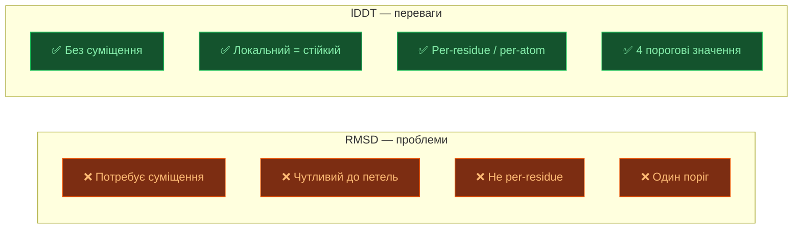
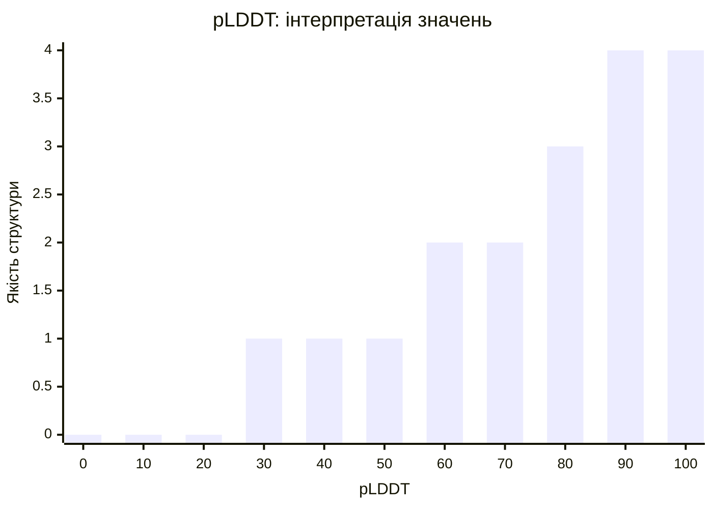

# lDDT — Local Distance Difference Test

[[UA/Головна]] > [[UA/Індекс|Концепції]] > Структурна біоінформатика
🇬🇧 [[EN/2. Concepts/2.3. Structural-Bioinformatics/2.3.2. lDDT|English]]

> **lDDT** — метрика структурної точності, яка **не потребує суміщення** структур. Оцінює збереження локальних відстаней між атомами у межах заданого радіусу включення.

---

## Математичне визначення

$$\text{lDDT} = \frac{1}{4}\sum_{t\in\{0.5,\,1,\,2,\,4\}\text{ Å}} \frac{\#\text{збережених контактів}(t)}{\#\text{всіх контактів}}$$

Контакт між атомами $i, j$ вважається **збереженим** при порозі $t$:

$$\bigl|\,d_{ij}^\text{pred} - d_{ij}^\text{true}\bigr| \leq t$$

де $d_{ij} = \|\mathbf{r}_i - \mathbf{r}_j\|$ — відстань між атомами, і обидва знаходяться в межах **радіусу включення 15 Å** у референсній структурі.

## Переваги над RMSD

## pLDDT в AlphaFold

**pLDDT** (predicted lDDT) — міра **власної впевненості** AF3 у кожному атомі:

$$\text{pLDDT}_i \in [0, 100]$$

Важливо: pLDDT **не є** RMSD-похідною метрикою — це передбачення lDDT до гіпотетичної експериментальної структури.

### Кольорова схема в Mol* / AF3 viewer

| pLDDT | Колір | Інтерпретація |
|-------|-------|--------------|
| **> 90** | 🔵 Синій | Дуже висока впевненість |
| **70–90** | 🟦 Блакитний | Висока впевненість |
| **50–70** | 🟡 Жовтий | Низька впевненість (петлі, гнучкі регіони) |
| **< 50** | 🟠 Оранжевий | Дуже низька — можливо IDR або помилка |

## lDDT для різних типів молекул

AF3 обчислює lDDT для всіх типів атомів:

| Тип | Метрика | Примітка |
|-----|---------|---------|
| Білок | **pLDDT** (per-Cα) | Основна метрика впевненості |
| Нуклеїнові кислоти | **pLDDT-NA** (per-C1') | Аналогічно для ДНК/РНК |
| Ліганди | **pLDDT-L** | Нижча надійність |
| Іони | — | Не обчислюється |

## lDDT vs RMSD: коли що використовувати

| Сценарій | Рекомендована метрика |
|----------|----------------------|
| Глобальна складка білку | TM-score або Cα RMSD |
| Бічні ланцюги | lDDT-all-atom |
| Гнучкий регіон (петля) | lDDT (стійкий до outliers) |
| Впевненість у предикції | pLDDT |
| Якість докінгу ліганду | RMSD < 2 Å + DockQ |

> Mariani et al. (2013). *lDDT: a local superposition-free score for comparing protein structures and models*. Bioinformatics 29.
> DOI: [10.1093/bioinformatics/btt473](https://doi.org/10.1093/bioinformatics/btt473)

---

## Пов'язані нотатки

- [[UA/2. Концепції/2.3. Структурна-Біоінформатика/2.3.1. RMSD]]
- [[UA/2. Концепції/2.3. Структурна-Біоінформатика/2.3.3. DockQ]]
- [[UA/1. AlphaFold3/1.3. Результати/1.3.2. Ступінь впевненості]]
- [[UA/1. AlphaFold3/1.2. Архітектура/1.2.5. Навчання моделі]]
