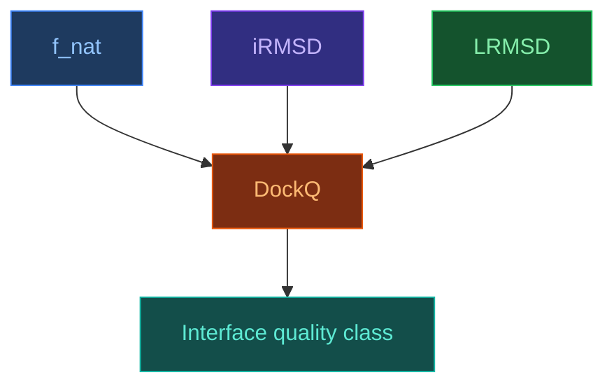

# DockQ — метрика якості інтерфейсу комплексу

[[UA/Головна]] > [[UA/Індекс|Концепції]] > Структурна біоінформатика
🇬🇧 [[EN/2. Concepts/2.3. Structural-Bioinformatics/2.3.3. DockQ|English]]

> **DockQ** — узагальнена метрика для оцінки якості docking або complex prediction, яка об'єднує збереження нативних контактів і дві RMSD-подібні компоненти в одне число від `0` до `1`.

## Чому DockQ потрібен

Для комплексів однієї метрики часто недостатньо:

- `RMSD` добре бачить відхилення координат;
- `f_nat` добре описує збереження інтерфейсних контактів;
- `iRMSD` краще оцінює геометрію саме інтерфейсу.

DockQ корисний тим, що перетворює ці сигнали в одну узгоджену шкалу, ближчу до практичного питання:

"наскільки prediction справді відтворює правильний interface?"

## Формальне визначення

У базовому варіанті:

$$\mathrm{DockQ}=\frac{f_{\mathrm{nat}}+\frac{1}{1+(i\mathrm{RMSD}/1.5)^2}+\frac{1}{1+(L\mathrm{RMSD}/8.5)^2}}{3}$$

де:

- $f_{\mathrm{nat}}$ — частка нативних контактів;
- $i\mathrm{RMSD}$ — interface RMSD;
- $L\mathrm{RMSD}$ — ligand RMSD після суміщення рецептора.

## Компоненти DockQ

## Інтуїція компонент

- **`f_nat`** відповідає на питання, чи prediction зберіг реальні контакти між партнерами.
- **`iRMSD`** показує, наскільки правильно розміщені атоми саме на інтерфейсі.
- **`LRMSD`** оцінює, наскільки правильно сидить ligand/partner chain після суміщення рецептора.

Ця комбінація корисніша, ніж будь-яка з компонент окремо.

## Типова шкала якості

| DockQ | Типове трактування |
|---|---|
| `< 0.23` | Некоректний interface |
| `0.23–0.49` | Acceptable |
| `0.49–0.80` | Medium quality |
| `> 0.80` | High quality |

## DockQ v2

`DockQ v2` розширює логіку метрики на:

- protein multimers;
- nucleic-acid complexes;
- small-molecule binding models.

Це важливо, бо сучасні benchmarks дедалі частіше включають не лише класичний protein-protein docking.

## Властивості DockQ

- **Інтерфейсна спрямованість**: метрика фокусується не просто на всій структурі, а на правильності взаємодії.
- **Нормалізована шкала `0..1`**: зручна для benchmark-порівнянь.
- **Комбінована логіка**: балансує contact preservation і geometric deviation.
- **Зручність для ranking**: корисна для оцінки docking predictions і multimer models.

## Обмеження

- **Не є повною фізичною метрикою**: хороший DockQ не гарантує правильну енергію зв'язування.
- **Залежить від визначення інтерфейсу і контактів**.
- **Може не вловлювати всіх chemistry-specific дефектів**: для ligand cases потрібні додаткові тести на stereochemistry і clashes.

## DockQ у зв'язці з іншими метриками

| Метрика | Що краще показує |
|---|---|
| [[UA/2. Концепції/2.3. Структурна-Біоінформатика/2.3.1. RMSD]] | Глобальне або pose-level відхилення |
| [[UA/2. Концепції/2.3. Структурна-Біоінформатика/2.3.2. lDDT]] | Локальну геометричну якість |
| [[UA/2. Концепції/2.3. Структурна-Біоінформатика/2.3.3. DockQ]] | Правильність інтерфейсу комплексу |
| `PoseBusters` | Хімічну правдоподібність ligand pose |

## Чому DockQ важливий для AlphaFold 3

Для AF3 DockQ важливий тому, що модель часто оцінюють на задачах взаємодії, а не лише на мономерній геометрії.
У таких сценаріях саме interface quality є більш інформативною за одну глобальну RMSD-оцінку.

## Пов'язані нотатки

- [[UA/2. Концепції/2.3. Структурна-Біоінформатика/2.3.1. RMSD|RMSD]]
- [[UA/2. Концепції/2.3. Структурна-Біоінформатика/2.3.2. lDDT|lDDT]]
- [[UA/2. Концепції/2.1. Біологія/2.1.3. Ліганди та малі молекули|Ліганди та малі молекули]]
- [[UA/1. AlphaFold3/1.3. Результати/1.3.1. Точність по типах комплексів|Точність по типах комплексів]]

> Basu and Wallner (2016). *DockQ: A Quality Measure for Protein-Protein Docking Models*. PLOS ONE.
> DOI: [10.1371/journal.pone.0161879](https://doi.org/10.1371/journal.pone.0161879)

> Sverrisson et al. (2023). *DockQ v2: Improved automatic quality measure for protein multimers, nucleic acids and small molecule binding models*.
> DOI: [10.48550/arXiv.2310.09580](https://doi.org/10.48550/arXiv.2310.09580)
