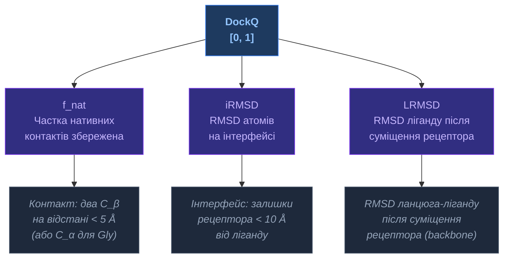
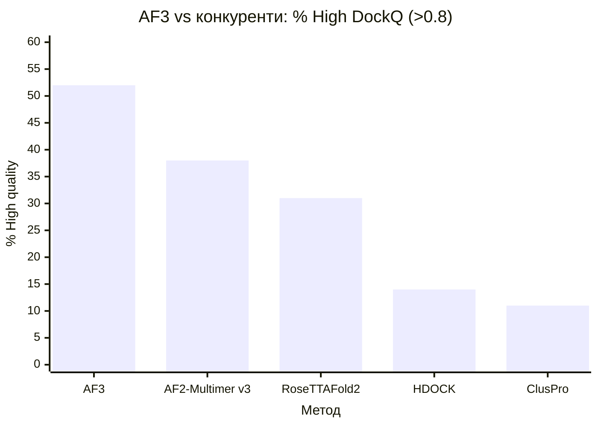

# DockQ — Комплексна метрика якості докінгу

[[🏠 Головна]] > [[UA/2.0. Індекс|Концепції]] > Структурна біоінформатика
🇬🇧 [[EN/2. Concepts/2.3. Structural-Bioinformatics/2.3.3. DockQ|English]]

> **DockQ** — уніфікована метрика для оцінки якості молекулярного докінгу та структури комплексів. Об'єднує кілька підметрик в єдиний показник від 0 до 1.

---

## Визначення

$$\text{DockQ} = \frac{f_\text{nat} + \frac{1}{1+(i\text{RMSD}/1.5)^2} + \frac{1}{1+(L_\text{RMSD}/8.5)^2}}{3}$$

де:
- $f_\text{nat}$ — частка нативних контактів
- $i\text{RMSD}$ — interface RMSD (Å)
- $L_\text{RMSD}$ — ligand RMSD (Å), тобто RMSD ланцюга після суміщення рецептора

## Компоненти DockQ

## Шкала якості

| DockQ | Категорія | $f_\text{nat}$ | $i$RMSD | $L$RMSD |
|-------|-----------|-----------------|---------|---------|
| **< 0.23** | ❌ Incorrect | < 0.1 | > 4.0 Å | > 10 Å |
| **0.23–0.49** | ⚠️ Acceptable | 0.1–0.3 | 2.0–4.0 Å | 5–10 Å |
| **0.49–0.80** | ✅ Medium | 0.3–0.5 | 1.0–2.0 Å | 1–5 Å |
| **> 0.80** | ✅✅ High | > 0.5 | < 1.0 Å | < 1 Å |

## DockQ v2 (2023) — розширення

DockQ v2 додає підтримку нуклеїнових кислот і малих молекул:

$$\text{DockQ}_\text{v2} = \text{DockQ}(f_\text{nat}, i\text{RMSD}, L\text{RMSD}, \text{типи молекул})$$

Зміни:
- Для РНК/ДНК: визначення контактів через $C1'$ (замість $C_\beta$)
- Для лігандів: використання RMSD атомів ліганду
- Мультимерні комплекси: усереднення DockQ по парах ланцюгів

> Basu & Wallner (2016). *DockQ: A Quality Measure for Protein-Protein Docking Models*. PLoS ONE 11.
> DOI: [10.1371/journal.pone.0161879](https://doi.org/10.1371/journal.pone.0161879)

> Sverrisson et al. (2023). *DockQ v2: Improved automatic quality measure for protein multimers, nucleic acids and small molecule binding models*.
> DOI: [10.48550/arXiv.2310.09580](https://doi.org/10.48550/arXiv.2310.09580)

## Результати AF3 за DockQ

| Тип комплексу | AF3 (%High) | AF2-Multimer (%High) |
|---------------|-------------|----------------------|
| Білок-білок | **52%** | 38% |
| Антитіло-антиген | **62.9%** | 44% |
| Білок-нуклеїнова к-та | **покращення** | baseline |

## PoseBusters — стандарт для ліганд-білок

PoseBusters — набір з 428 нещодавніх структур (після 2021) для оцінки ліганд-білок докінгу. Перевіряє не лише RMSD, а й:
- Хімічну валідність ліганду
- Відповідність стереохімії
- Відсутність зіткнень

AF3 досягає **76.4%** (vs ~20–40% у попередників).

---

## Пов'язані нотатки

- [[UA/2. Концепції/2.3. Структурна-Біоінформатика/2.3.1. RMSD]]
- [[UA/2. Концепції/2.3. Структурна-Біоінформатика/2.3.2. lDDT]]
- [[UA/2. Концепції/2.1. Біологія/2.1.3. Ліганди та малі молекули]]
- [[UA/1. AlphaFold3/1.3. Результати/1.3.1. Точність по типах комплексів]]
