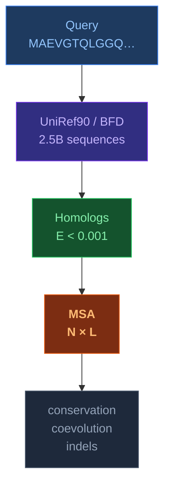
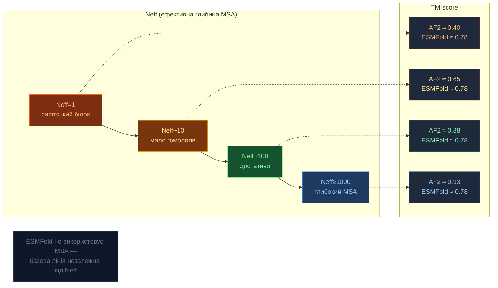

# MSA — Multiple Sequence Alignment

[[UA/Головна]] > [[UA/Індекс|Концепції]] > Структурна біоінформатика
🇬🇧 [[EN/2. Concepts/2.3. Structural-Bioinformatics/2.3.4. MSA|English]]

> **MSA** — вирівнювання трьох і більше еволюційно споріднених послідовностей для виявлення консервативних залишків, функціональних сайтів і коеволюційних пар. Ключовий вхід для AlphaFold 2.

---

## Що таке MSA



## Алгоритми побудови MSA

| Алгоритм | Тип | Складність | Використання в AF |
|----------|-----|-----------|-------------------|
| **Needleman-Wunsch** | Глобальний (пара) | $O(mn)$ | — |
| **Smith-Waterman** | Локальний (пара) | $O(mn)$ | — |
| **HHblits** | Profile-HMM | $O(N\cdot L^2)$ | ✅ AF2, AF3 |
| **Jackhmmer** | Ітеративний | $O(k\cdot N\cdot L)$ | ✅ AF2, AF3 |
| **ColabFold MMseqs2** | Швидкий LSH | $O(N)$ | ✅ ColabFold |

## Коеволюційний сигнал

**Ключова ідея**: якщо залишки $i$ і $j$ взаємодіють, мутації в одному компенсуються мутаціями в іншому:

$$C_{ij} = \langle x_i x_j \rangle - \langle x_i \rangle\langle x_j \rangle$$

де $x_i$ — амінокислота на позиції $i$ в MSA. Матриця $C$ після DCA/MI → контактна карта.

### Mutual Information (MI)

$$\text{MI}(i,j) = \sum_{a,b} p_{ij}(a,b)\log\frac{p_{ij}(a,b)}{p_i(a)\,p_j(b)}$$

AF2/AF3 навчаються **безпосередньо** з MSA — не потребують явного обчислення MI.

## MSA depth: скільки гомологів потрібно?



$N_\text{eff}$ — ефективна кількість послідовностей (з урахуванням надмірності):

$$N_\text{eff} = \sum_i \frac{1}{\sum_j \mathbf{1}[\text{seq\_id}(i,j) > 80\%]}$$

## AF3 і MSA: менше, але розумніше

Порівняно з AF2, AF3 **зменшив роль MSA**:

| | AF2 | AF3 |
|--|-----|-----|
| MSA блоки | 48 | **4** |
| Pair блоки | 48 | **48** |
| MSA субвибірка | 512 рядків | 1024 рядки |
| Без MSA | Дуже погано | Прийнятно (pLM-компенсація) |

Раціональне: парне представлення ($z_{ij}$) вже кодує коеволюційний сигнал. MSA потрібен менше, якщо `pair representation` (парне представлення) достатньо глибоке.

## Формати MSA файлів

```
# A3M format (HHblits / ColabFold output):
>query
MAEVGTQLGGQVATNLGLKL
>UniRef90_P12345 homolog1
MAEVGTQLGGQVATNLGLKL
>UniRef90_Q98765 homolog2
MAEVGTQaaLGGQVATNLGLKL   ← `lowercase` = інсерція відносно `query`
>UniRef90_A11111 homolog3
MAEVG--LGGQVATNLGLKL     ← `-` = `gap` (пропуск) у вирівняній колонці
```

- **A3M** — стиснений MSA-формат; `lowercase` позначає інсерції, `-` позначає `gap` у вирівняних колонках, `.` інколи використовується як `placeholder` (заповнювач) в `insert-only` колонках
- **FASTA** — стандартний, всі позиції збережені
- **Stockholm** — з анотаціями (Pfam, Rfam)

> Remmert et al. (2012). *HHblits: lightning-fast iterative protein sequence searching by HMM-HMM alignment*. Nat Methods 9.
> DOI: [10.1038/nmeth.1818](https://doi.org/10.1038/nmeth.1818)

---

## Пов'язані нотатки

- [[UA/2. Концепції/2.2. Машинне-Навчання/2.2.3. Білкові мовні моделі]]
- [[UA/1. AlphaFold3/1.2. Архітектура/1.2.2. Pairformer]]
- [[UA/1. AlphaFold3/1.2. Архітектура/1.2.5. Навчання моделі]]
- [[UA/1. AlphaFold3/1.5. Ресурси/1.5.3. Робота з FASTA файлами]]
- [[UA/1. AlphaFold3/1.5. Ресурси/1.5.6. Робота з A3M файлами]]
