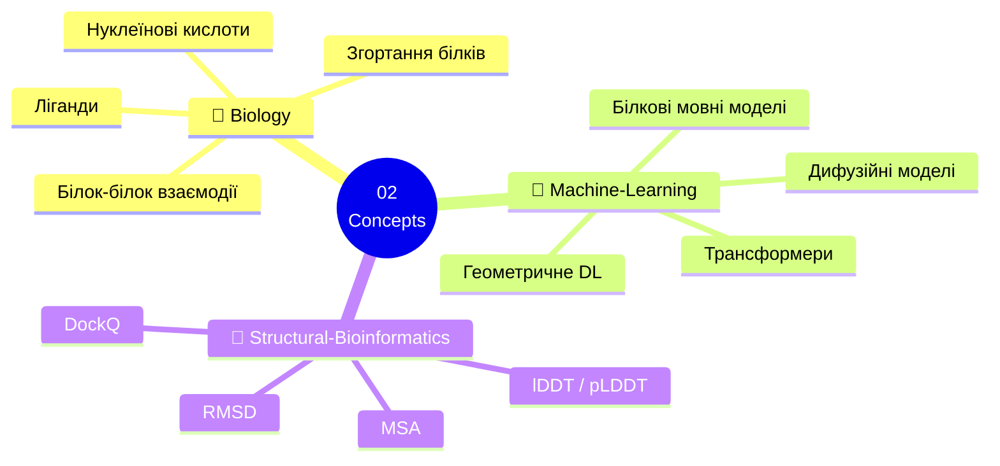
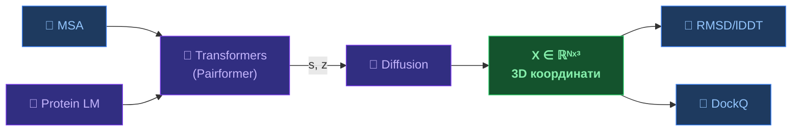

# 🧠 02 — Концепції

[[🏠 Головна]] | 🇬🇧 [[EN/2.0. Index|English]]

Тематичний довідник: фундаментальні поняття біології, ML та структурної біоінформатики в основі AlphaFold 3.

---

---

## 🧬 Biology

| Тема | Ключові поняття | Зв'язок з AF3 |
|------|-----------------|---------------|
| [[UA/2. Концепції/2.1. Біологія/2.1.1. Згортання білків\|Згортання білків]] | Levinthal, воронка, вторинна структура | AF3 генерує координати напряму |
| [[UA/2. Концепції/2.1. Біологія/2.1.2. Білок-білок взаємодії\|Білок-білок взаємодії]] | BSA, ΔG_bind, інтерфейс, ipTM | AF3 → 76.6% DockQ high |
| [[UA/2. Концепції/2.1. Біологія/2.1.3. Ліганди та малі молекули\|Ліганди та малі молекули]] | K_d, Ro5, кишеня, докінг | AF3 → 76.4% PoseBusters |
| [[UA/2. Концепції/2.1. Біологія/2.1.4. Нуклеїнові кислоти\|Нуклеїнові кислоти]] | ДНК/РНК структура, мотиви | AF3 — перша генеральна модель |

## 🤖 Machine Learning

| Тема | Ключові поняття | Зв'язок з AF3 |
|------|-----------------|---------------|
| [[UA/2. Концепції/2.2. Машинне-Навчання/2.2.1. Трансформери\|Трансформери]] | MHA, Pairformer, IPA, SE(3) | Pairformer = 48 блоків |
| [[UA/2. Концепції/2.2. Машинне-Навчання/2.2.2. Дифузійні моделі\|Дифузійні моделі]] | DDPM, DDIM, Score SDE | → [[UA/1. AlphaFold3/1.2. Архітектура/1.2.4. Дифузійні моделі — теорія та застосування\|детальна нотатка]] |
| [[UA/2. Концепції/2.2. Машинне-Навчання/2.2.3. Білкові мовні моделі\|Білкові мовні моделі]] | ESM-2, MLM, embeddings | Input embedder у AF3 |
| [[UA/2. Концепції/2.2. Машинне-Навчання/2.2.4. Геометричне глибоке навчання\|Геометричне DL]] | E(3)/SE(3), EGNN, еквіваріантність | IPA у diffusion module |

## 📐 Structural Bioinformatics

| Тема | Формула | Поріг |
|------|---------|-------|
| [[UA/2. Концепції/2.3. Структурна-Біоінформатика/2.3.1. RMSD\|RMSD]] | $\sqrt{\tfrac{1}{N}\sum\|r_i^\text{pred}-r_i^\text{true}\|^2}$ | < 2 Å ✅ |
| [[UA/2. Концепції/2.3. Структурна-Біоінформатика/2.3.2. lDDT\|lDDT / pLDDT]] | Збережені контакти при 4 порогах | > 90 ✅, < 50 ⚠️ |
| [[UA/2. Концепції/2.3. Структурна-Біоінформатика/2.3.3. DockQ\|DockQ]] | $(f_\text{nat} + f_\text{iRMSD} + f_\text{LRMSD})/3$ | > 0.8 ✅ |
| [[UA/2. Концепції/2.3. Структурна-Біоінформатика/2.3.4. MSA\|MSA]] | Вирівнювання + коеволюція | $N_\text{eff} > 100$ |

---

## 🔗 Концепти → AF3

