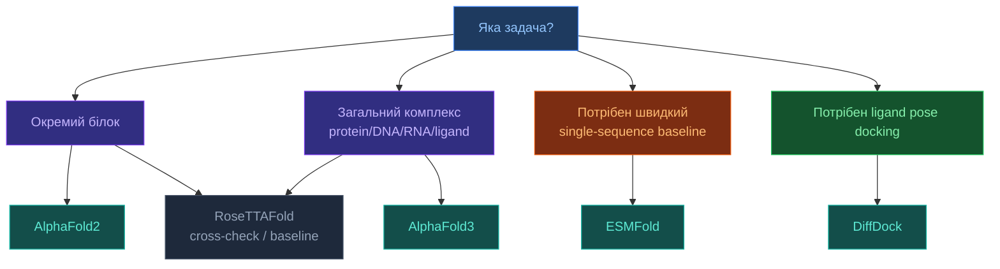

# 3.0. Огляд моделей

[[UA/Головна]] > Моделі
🇬🇧 [[EN/3. Models/3.0. Models Overview|English]]

Порівняльний огляд основних моделей для передбачення структури, мультимолекулярних комплексів і ligand docking.

## Навіщо потрібен окремий огляд моделей

У структурній біоінформатиці немає однієї універсально найкращої моделі для всіх задач.
Різні системи оптимізовані під різні режими:

- `single-chain structure prediction`;
- `complex prediction`;
- `single-sequence fast inference`;
- `ligand pose prediction`;
- `structure-conditioned sequence design`.

Тому коректний вибір моделі залежить не лише від "точності загалом", а від типу вхідних даних, потрібного виходу, обчислювального бюджету й того, чи потрібна фізично правдоподібна поза ліганду, чи повна архітектура комплексу.

## Ключові сімейства

| Модель | Основна задача | Головна ідея | Сильні сторони | Обмеження |
| --- | --- | --- | --- | --- |
| [[UA/3. Моделі/3.1. AlphaFold2]] | Структура білків | Evoformer + structure module | Дуже сильний baseline для білків | Слабше пристосований до загальної мультимолекулярності |
| [[UA/3. Моделі/3.2. AlphaFold3]] | Комплекси білок/ДНК/РНК/ліганд | Unified multimolecular modeling + diffusion | Один фреймворк для багатьох типів сутностей | Високі вимоги до ресурсів і складність інтерпретації |
| [[UA/3. Моделі/3.3. RoseTTAFold]] | Білки та частина комплексів | Three-track 1D/2D/3D integration | Сильний академічний baseline і корисна незалежна перевірка | Часто поступається новішим системам на складних задачах |
| [[UA/3. Моделі/3.4. ESMFold]] | Швидке sequence-to-structure | pLM + structure head без повного MSA | Швидкий single-sequence inference | Зазвичай нижча точність у складних кейсах |
| [[UA/3. Моделі/3.5. DiffDock]] | Docking малих молекул | Generative diffusion over ligand pose space | Сильний спеціалізований docking-підхід | Не замінює загальну модель біомолекулярного комплексу |
| [[UA/3. Моделі/3.6. OpenFold]] | Trainable open `AF2` stack | Reproducible PyTorch retraining і engineering | Найкращий open reference для модифікації `AF2`-class systems | Менш широкий, ніж `AF3`-style multimolecular models |
| [[UA/3. Моделі/3.7. Boltz-1]] | Відкрите biomolecular interaction modeling | Open `AF3`-adjacent local workflow | Відкриті ваги, код і широкий фокус на комплексах | І література, і ПЗ швидко змінюються |
| [[UA/3. Моделі/3.8. Chai-1]] | Multi-modal complex prediction | Open foundation-model workflow для complex structure prediction | Широкий local stack з templates, MSAs і restraints | Вимогливий до hardware і ще швидко змінюється |
| [[UA/3. Моделі/3.9. RoseTTAFoldNA]] | Комплекси protein–DNA / protein–RNA | Nucleic-acid-aware розширення RoseTTAFold | Сильний спеціалізований baseline для нуклеїнових комплексів | Вужчий, ніж general biomolecular model |

## Як грубо обирати модель

## Властивості, за якими моделі реально відрізняються

- **Тип вхідного сигналу**: лише sequence, sequence + MSA, sequence + ligand description, або структура кишені.
- **Тип виходу**: повний 3D-комплекс, monomer structure, ligand pose, або sequence design.
- **Індуктивний bias**: attention, three-track fusion, diffusion, pLM priors, geometric reasoning.
- **Швидкість і пам'ять**: fast baseline і high-accuracy generalist часто є різними моделями.
- **Режим узагальнення**: деякі моделі сильні в білках, але слабші на nucleic acids або ligand-heavy complexes.

## Практичні сценарії

### Коли брати `AlphaFold2`

- якщо задача майже повністю про окремий білок;
- якщо потрібен зрозумілий і перевірений baseline;
- якщо мультимолекулярний контекст не є головним.

### Коли брати `AlphaFold3`

- якщо в одному комплексі є білки, нуклеїнові кислоти, ліганди, модифікації або іони;
- якщо потрібна одна узгоджена модель комплексу, а не набір окремих спеціалізованих тулів;
- якщо є ресурс на важчу inference-процедуру.

### Коли брати `ESMFold`

- якщо потрібен швидкий single-sequence прогноз;
- якщо MSA слабке, дороге або недоступне;
- якщо потрібен screening, а не фінальна структурна валідація.

### Коли брати `DiffDock`

- якщо задача саме в docking pose ліганду;
- якщо є білкова кишеня і треба отримати правдоподібні candidate poses;
- якщо повний комплекс краще будувати окремим пайплайном.

### Коли брати `RoseTTAFold`

- якщо потрібна незалежна альтернатива AF-пайплайнам;
- якщо важливо перевірити, чи висновок відтворюється на іншій архітектурі;
- якщо потрібен сильний академічний baseline.

### Коли брати `OpenFold`

- якщо важливі retraining, ablations або модифікація архітектури;
- якщо лабораторії потрібен open `AF2`-class engineering reference;
- якщо reproducibility важливіший за hosted black-box workflow.

### Коли брати `Boltz-1` або `Chai-1`

- якщо потрібна відкрита локальна альтернатива `AF3`-like complex modeling;
- якщо важливо benchmark'ити open multimolecular stacks;
- якщо local automation і inspectable code є обов'язковими вимогами.

### Коли брати `RoseTTAFoldNA`

- якщо задача головно про `protein–DNA` або `protein–RNA` комплекси;
- якщо спеціалізований nucleic-acid-aware baseline корисніший за broad generalist;
- якщо AF3-like failures треба перевірити через focused NA model.

## Обмеження огляду

- Табличне порівняння спрощує реальність: якість сильно залежить від типу об'єкта і benchmark.
- Високий aggregate-score не означає, що модель найкраща для кожного конкретного protein family або ligand class.
- На практиці якісні пайплайни часто комбінують кілька моделей, а не покладаються лише на одну.

## Пов'язані нотатки

- [[UA/3. Моделі/3.1. AlphaFold2|AlphaFold2]]
- [[UA/3. Моделі/3.2. AlphaFold3|AlphaFold3]]
- [[UA/3. Моделі/3.3. RoseTTAFold|RoseTTAFold]]
- [[UA/3. Моделі/3.4. ESMFold|ESMFold]]
- [[UA/3. Моделі/3.5. DiffDock|DiffDock]]
- [[UA/3. Моделі/3.6. OpenFold|OpenFold]]
- [[UA/3. Моделі/3.7. Boltz-1|Boltz-1]]
- [[UA/3. Моделі/3.8. Chai-1|Chai-1]]
- [[UA/3. Моделі/3.9. RoseTTAFoldNA|RoseTTAFoldNA]]
- [[UA/1. AlphaFold3/1.5. Ресурси/1.5.7. Foldseek і пошук структур|Foldseek і пошук структур]]

> Jumper et al. (2021). *Highly accurate protein structure prediction with AlphaFold*. Nature.
> DOI: [10.1038/s41586-021-03819-2](https://doi.org/10.1038/s41586-021-03819-2)

> Abramson et al. (2024). *Accurate structure prediction of biomolecular interactions with AlphaFold 3*. Nature.
> DOI: [10.1038/s41586-024-07487-w](https://doi.org/10.1038/s41586-024-07487-w)

> Baek et al. (2021). *Accurate prediction of protein structures and interactions using a three-track neural network*. Science.
> DOI: [10.1126/science.abj8754](https://doi.org/10.1126/science.abj8754)

> Lin et al. (2023). *Evolutionary-scale prediction of atomic-level protein structure with a language model*. Science.
> DOI: [10.1126/science.ade2574](https://doi.org/10.1126/science.ade2574)

> Corso et al. (2023). *DiffDock: Diffusion Steps, Twists, and Turns for Molecular Docking*. ICLR.
> DOI: [10.48550/arXiv.2210.01776](https://doi.org/10.48550/arXiv.2210.01776)
