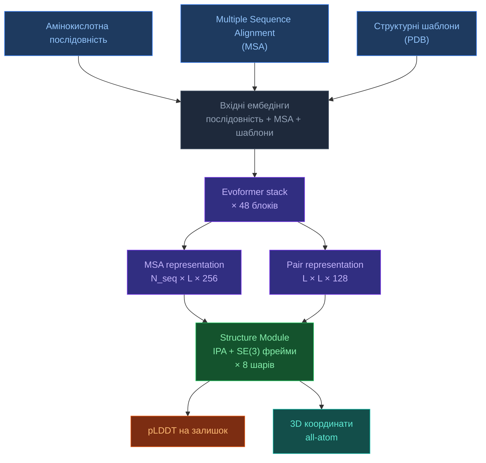

# 3.1. AlphaFold2

[[UA/Головна]] > [[UA/3. Моделі/3.0. Огляд моделей|Моделі]] > AlphaFold2
🇬🇧 [[EN/3. Models/3.1. AlphaFold2|English]]

> AlphaFold2 (2021) — перша модель, що досягла точності, близької до експериментальної, у передбаченні структур білків. Переможець CASP14 із медіанним GDT 92.4.

---

## Архітектура

### Ключові компоненти

**Evoformer** — головна інновація AF2. 48-блоковий трансформер, який у кожному блоці спільно оновлює два представлення:

- **MSA representation** `(N_seq × L × 256)` — фіксує еволюційні патерни між гомологами
- **Pair representation** `(L × L × 128)` — фіксує просторові відносини між усіма парами залишків

Ключові операції в одному блоці Evoformer:

| Операція | Де застосовується | Призначення |
|---|---|---|
| Row-wise gated self-attention | Рядки MSA | Крос-послідовна увага з pair bias |
| Column-wise self-attention | Стовпці MSA | Еволюційне змішування по позиції |
| MSA transition (MLP) | MSA | Нелінійне оновлення |
| Outer product mean | MSA → Pair | Проекція MSA-сигналу в pair-простір |
| Triangle multiplicative update | Pair | Нерівність трикутника для відстаней |
| Triangle self-attention | Pair | Глобальне pair-мислення |
| Pair transition (MLP) | Pair | Нелінійне оновлення |

**Structure Module** — перетворює pair/single представлення в 3D координати за допомогою:

- **Invariant Point Attention (IPA)** — SE(3)-еквіваріантна увага над rigid фреймами
- **Backbone фрейми** — кожен залишок як жорсте тіло $(R_i, t_i) \in SE(3)$
- **Торсійні кути бічних ланцюгів** — окрема мережа поверх single representation
- **8 recycling iterations** зі зупинкою градієнта між циклами

### Вхідні ознаки

| Ознака | Розмір | Джерело |
|---|---|---|
| Sequence one-hot | `L × 21` | Сира послідовність |
| MSA one-hot | `N_seq × L × 23` | HHblits / Jackhmmer |
| MSA pair features | `L × L × 88` | З MSA-статистики |
| Template features | `L × L × 88` | Структурні шаблони PDB |
| Residue index | `L` | Позиційний |

---

## Переваги

| Перевага | Деталі |
|---|---|
| Точність близька до експериментальної | Медіана GDT 92.4 на CASP14, TM-score > 0.9 для більшості |
| Добре відкалібрований pLDDT | Відповідає реальній точності |
| Відкриті ваги | ColabFold і LocalColabFold — безкоштовний доступ |
| Швидкий MSA з ColabFold | MMseqs2 скорочує час MSA з годин до хвилин |
| Екосистема | AF2-Multimer, AF2-design та інші похідні інструменти |

## Обмеження

| Обмеження | Деталі |
|---|---|
| Тільки білки | Немає лігандів, нуклеїнових кислот, малих молекул |
| MSA-залежність | Точність різко падає для «сирітських» послідовностей |
| Статична структура | Одна конформація — без динаміки чи ансамблю |
| Мультимери | AF2-Multimer слабший за AF3 на антитіло/антиген |
| Немає ковалентних модифікацій | Не підтримує пост-трансляційні модифікації |
| Упередженість шаблонів | Може надмірно покладатися на PDB-шаблони |

---

## AF2 vs AF3 — ключові відмінності

| Аспект | AlphaFold2 | AlphaFold3 |
|---|---|---|
| Молекулярний охоплення | Тільки білки | Білки, ДНК, РНК, ліганди, іони |
| Вихідний модуль | IPA + торсійні кути | Дифузійний модуль |
| Trunk | Evoformer | Pairformer (без MSA-рядків) |
| Роль MSA | Центральна (48 спільних блоків) | Тільки кодування входу |
| Метрики впевненості | pLDDT, PAE | pLDDT, PAE, pTM, ipTM, pDE |
| Докінг лігандів | ✗ | ✓ (PoseBusters 76.4%) |

---

> Jumper et al. (2021). *Highly accurate protein structure prediction with AlphaFold*. Nature, 596, 583–589.
> DOI: [10.1038/s41586-021-03819-2](https://doi.org/10.1038/s41586-021-03819-2)
