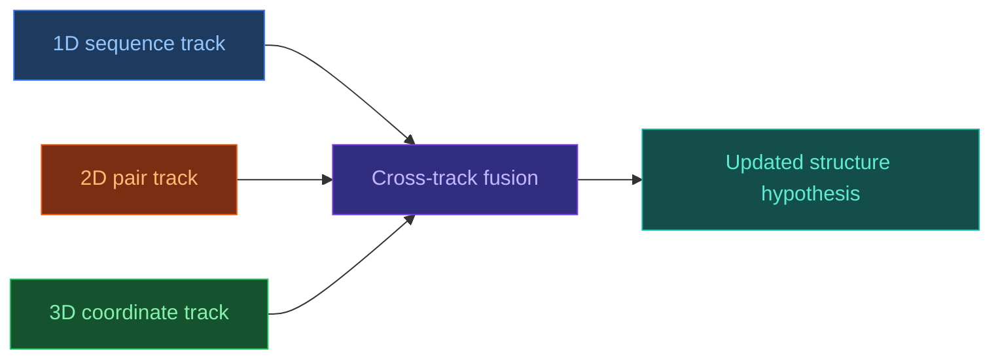

# 3.3. RoseTTAFold

[[UA/Головна]] > [[UA/3. Моделі/3.0. Огляд моделей|Моделі]] > RoseTTAFold
🇬🇧 [[EN/3. Models/3.3. RoseTTAFold|English]]

`RoseTTAFold` — нейромережева модель для структурного передбачення, яка одночасно інтегрує 1D-, 2D- і 3D-представлення білка через `three-track` архітектуру.

## Чому RoseTTAFold був важливим кроком

До появи RoseTTAFold було очевидно, що просте послідовнісне моделювання недостатнє для високоточної структури.
Потрібно було навчитися обмінюватися інформацією між:

- sequence-level ознаками;
- pairwise geometry;
- 3D-coordinate reasoning.

RoseTTAFold став знаковим саме через явну спільну інтеграцію цих трьох рівнів у межах єдиної моделі.

## Архітектурна ідея

Три "доріжки" моделі відповідають різним типам представлень:

- `1D track` для послідовності;
- `2D track` для pair- або distance-like information;
- `3D track` для coordinate-level reasoning.

## Властивості

- **Трирівнева інтеграція**: sequence, pair і coordinate reasoning пов'язані без жорсткого розділення на етапи.
- **Добрий академічний baseline**: RoseTTAFold часто корисний для незалежної перевірки результатів AF-подібних систем.
- **Практична корисність для structure solving**: модель використовували як допоміжний інструмент у cryo-EM і crystallography сценаріях.
- **Важлива історична роль**: це одна з моделей, що показали, наскільки потужним є joint reasoning між 1D/2D/3D представленнями.

## Коли RoseTTAFold корисний

- коли потрібен незалежний second opinion щодо структури;
- коли потрібен сильний, але не обов'язково найновіший baseline;
- коли дослідницький пайплайн орієнтований на академічну відтворюваність і comparative analysis.

## Обмеження

- **Часто нижча якість проти найсильніших новіших моделей**: особливо на складних сучасних benchmarks.
- **Не generalist-модель рівня AF3**: RoseTTAFold не був побудований як універсальний multimolecular framework.
- **Практична якість залежить від типу задачі**: білкові мономери, комплекси й спеціальні interaction cases мають різний профіль складності.

## Порівняння з близькими підходами

| Модель | Схожість із RoseTTAFold | Ключова відмінність |
|---|---|---|
| [[UA/3. Моделі/3.1. AlphaFold2]] | Також high-accuracy protein structure model | Інша trunk-організація та сильніша домінанта Evoformer-style processing |
| [[UA/3. Моделі/3.2. AlphaFold3]] | Також joint structural reasoning | AF3 значно ширший за типами молекул і використовує diffusion-based generation |
| [[UA/3. Моделі/3.4. ESMFold]] | Також служить практичним baseline | ESMFold більше спирається на pLM single-sequence prior |

## Пов'язані нотатки

- [[UA/3. Моделі/3.1. AlphaFold2|AlphaFold2]]
- [[UA/3. Моделі/3.2. AlphaFold3|AlphaFold3]]
- [[UA/3. Моделі/3.4. ESMFold|ESMFold]]
- [[UA/2. Концепції/2.2. Машинне-Навчання/2.2.1. Трансформери|Трансформери]]

> Baek et al. (2021). *Accurate prediction of protein structures and interactions using a three-track neural network*. Science.
> DOI: [10.1126/science.abj8754](https://doi.org/10.1126/science.abj8754)
