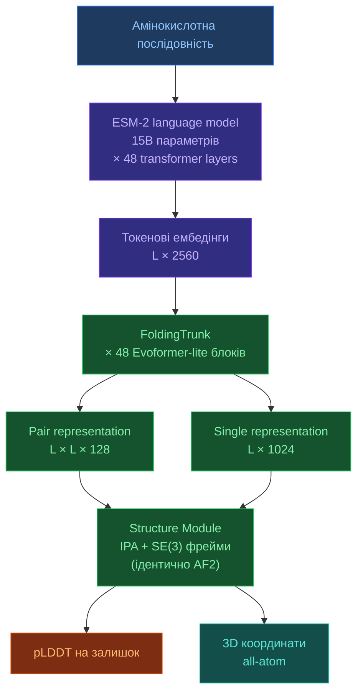

# 3.4. ESMFold

[[UA/Головна]] > [[UA/3. Моделі/3.0. Огляд моделей|Моделі]] > ESMFold
🇬🇧 [[EN/3. Models/3.4. ESMFold|English]]

> ESMFold (2022) — перший високоточний предиктор структур, що не потребує MSA. Еволюційна інформація закодована в вагах мовної моделі ESM-2 (15B параметрів).

---

## Архітектура

### Ключові компоненти

**ESM-2 (мовна модель)** — трансформер із 15B параметрами, навчений на 250 млн білкових послідовностей методом masked language modeling (MLM). Еволюційний контекст закодований у вагах — явний пошук MSA не потрібен.

| Варіант ESM-2 | Параметри | Шари | Hidden dim |
|---|---|---|---|
| ESM-2 (в ESMFold) | 15B | 48 | 5120 |
| ESM-2 medium | 650M | 33 | 1280 |
| ESM-2 small | 8M | 6 | 320 |

**FoldingTrunk** — легкий Evoformer-подібний стек, що будує pair/single представлення з ембедінгів ESM-2. Ключові відмінності від AF2 Evoformer:
- Немає MSA-рядків — тільки одна послідовність
- Менше `recycling iterations` (4 vs 8 у AF2)
- Pair representation ініціалізується з outer product ESM-2 ембедінгів

**Structure Module** — ідентичний AF2: IPA + SE(3) rigid фрейми + передбачення торсійних кутів.

### Час інференсу

| Етап | Час (L=300) | Примітка |
|---|---|---|
| ESM-2 forward pass | ~0.5 с (GPU) | Вузьке місце для довгих послідовностей |
| FoldingTrunk | ~0.3 с | Evoformer-lite, 48 блоків |
| Structure Module | ~0.1 с | IPA, 8 шарів |
| **Разом** | **~1 с** | vs ~10–60 с для AF2 + MSA |

---

## Переваги

| Перевага | Деталі |
|---|---|
| Не потребує MSA | Одна послідовність на вхід → структура за ~1 с |
| Масштабованість | Підходить для скринінгу цілих протеомів |
| Сирітські послідовності | Працює на білках без еволюційних гомологів |
| Проста інфраструктура | Без HHblits/Jackhmmer/баз даних |
| Потужні ембедінги | ESM-2 представлення корисні для функціонального аналізу |
| Відкриті ваги | Meta AI відкрила ваги моделі |

## Обмеження

| Обмеження | Деталі |
|---|---|
| Відставання в точності | ~5–10% нижче AF2 на CAMEO/CASP для середніх цілей |
| Тільки білки | Немає малих молекул чи нуклеїнових кислот |
| Велика пам'ять GPU | ESM-2 15B потребує ~45 GB VRAM (A100) |
| Довгі послідовності | Квадратична пам'ять у pair; проблеми вище L≈700 |
| Без явної коеволюції | Втрачає попарний сигнал контактів, присутній у реальних MSA |
| Статичне передбачення | Одна конформація, без динаміки |

---

## ESMFold vs AF2 vs AF3

| Аспект | ESMFold | AlphaFold2 | AlphaFold3 |
|---|---|---|---|
| MSA потрібна | ✗ | ✓ | Опціонально |
| Швидкість | ~1 с | ~10–60 с | ~60–300 с |
| Точність (мономери) | Добра | Відмінна | Відмінна |
| Докінг лігандів | ✗ | ✗ | ✓ |
| Нуклеїнові кислоти | ✗ | ✗ | ✓ |
| GPU пам'ять | ~45 GB | ~8 GB | ~16 GB |
| Відкриті ваги | ✓ | ✓ | ✗ (тільки сервер) |

---

> Lin et al. (2023). *Evolutionary-scale prediction of atomic-level protein structure with a language model*. Science, 379(6637), 1123–1130.
> DOI: [10.1126/science.ade2574](https://doi.org/10.1126/science.ade2574)
