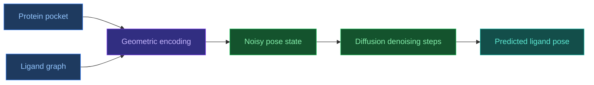

# 3.5. DiffDock

[[UA/Головна]] > [[UA/3. Моделі/3.0. Огляд моделей|Моделі]] > DiffDock
🇬🇧 [[EN/3. Models/3.5. DiffDock|English]]

`DiffDock` — дифузійна модель для ligand docking, яка генерує правдоподібні пози (`poses`) малої молекули в білковій кишені як задачу стохастичного уточнення трансляції, обертання та торсійних ступенів свободи.

## Чому DiffDock важливий

Класичний docking зазвичай поєднує:

- явний або евристичний пошук по pose-space;
- scoring function;
- reranking.

DiffDock зміщує фокус із ручного search-процесу до generative modeling:
замість жорсткого перебору модель вчиться породжувати binding poses безпосередньо як розподіл над можливими конфігураціями.

## Архітектурна ідея

Модель розглядає docking як генеративний процес у просторі ligand pose:

- translation;
- rotation;
- torsion angles.

## Властивості

- **Generative docking**: pose prediction формулюється як генерація, а не лише regression або search.
- **Явна робота з невизначеністю**: можна отримувати кілька candidate poses, а не лише одну відповідь.
- **Геометрична природність**: модель працює з простором реальних ступенів свободи docking-задачі.
- **Сильна спеціалізація**: це не загальний biomolecular complex predictor, а вузько сфокусований docking-метод.

## Коли DiffDock корисний

- коли головна задача полягає в передбаченні ligand pose у відомій або передбаченій кишені;
- коли потрібен швидкий modern baseline для small-molecule docking;
- коли корисно згенерувати кілька plausible binding configurations для подальшого аналізу.

## Обмеження

- **Вузька постановка задачі**: DiffDock не замінює повний generalist-підхід на кшталт AF3.
- **Якість залежить від кишені й вхідної геометрії**: якщо pocket context неточний, поза також деградує.
- **Docking не дорівнює повній біофізиці зв'язування**: гарна поза ще не означає правильну affinity або реальну динаміку комплексу.
- **Потребує подальшої валідації**: MD, rescoring або експеримент можуть бути потрібні для високих ставок.

## Порівняння з близькими підходами

| Підхід | Схожість | Відмінність |
|---|---|---|
| Класичний docking (`Vina`-тип) | Та сама кінцева задача ligand pose | Зазвичай search + scoring замість generative diffusion |
| [[UA/3. Моделі/3.2. AlphaFold3]] | Також працює з ligand-containing systems | AF3 моделює ширший комплекс, а не лише docking pose |
| [[UA/2. Концепції/2.2. Машинне-Навчання/2.2.2. Дифузійні моделі]] | Спільний генеративний принцип | DiffDock є спеціалізованим прикладом diffusion для docking-space |

## Пов'язані нотатки

- [[UA/2. Концепції/2.2. Машинне-Навчання/2.2.2. Дифузійні моделі|Дифузійні моделі]]
- [[UA/2. Концепції/2.1. Біологія/2.1.3. Ліганди та малі молекули|Ліганди та малі молекули]]
- [[UA/3. Моделі/3.2. AlphaFold3|AlphaFold3]]

> Corso et al. (2023). *DiffDock: Diffusion Steps, Twists, and Turns for Molecular Docking*. ICLR.
> DOI: [10.48550/arXiv.2210.01776](https://doi.org/10.48550/arXiv.2210.01776)
