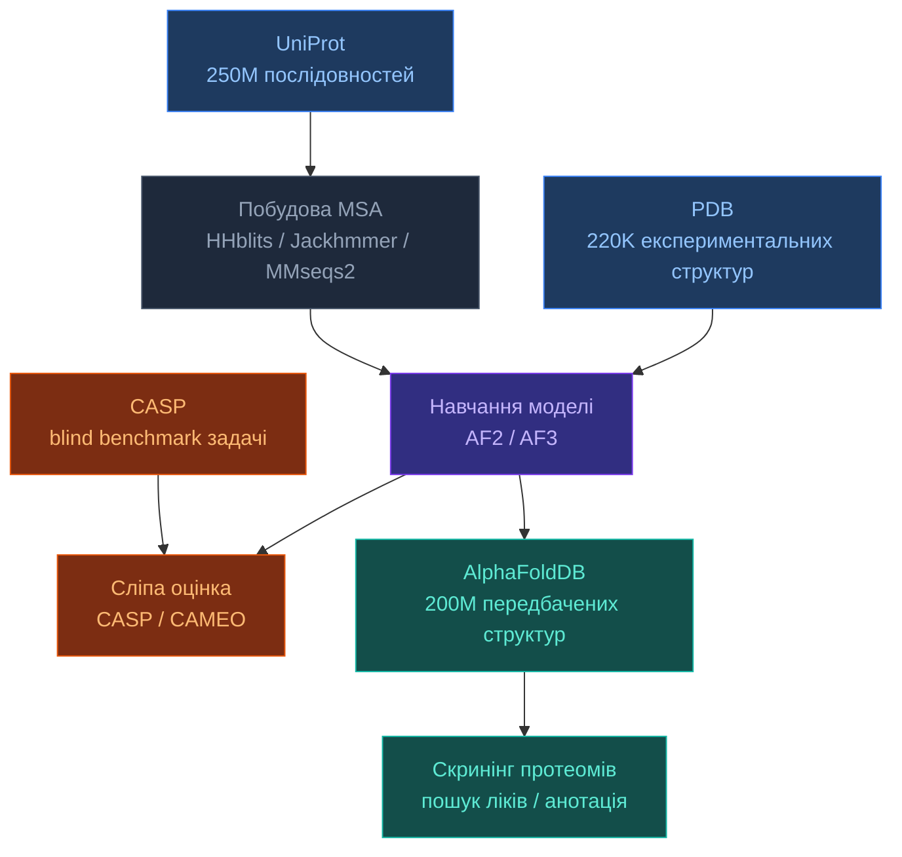

# 4.0. Огляд датасетів

[[UA/Головна]] > Датасети
🇬🇧 [[EN/4. Datasets/4.0. Datasets Overview]]

Ключові джерела даних для структурної біоінформатики та пайплайнів AF3.

---

## Карта датасетів

## Швидке порівняння

| Датасет | Тип | Розмір | Відкритий | Ліганди | Комплекси | Роль в AF |
|---|---|---|---|---|---|---|
| [[UA/4. Датасети/4.1. PDB]] | Експериментальний | ~220K структур | ✓ | ✓ | ✓ | Ground truth для навчання |
| [[UA/4. Датасети/4.2. UniProt]] | Послідовності | ~250M записів | ✓ | — | — | MSA + вхід послідовності |
| [[UA/4. Датасети/4.3. AlphaFoldDB]] | Передбачений | ~200M структур | ✓ | ✗ | ✗ | Скринінг після передбачення |
| [[UA/4. Датасети/4.4. CASP]] | Бенчмарк | ~100–150 задач/раунд | ✓ | ✗ | Частково | Сліпа оцінка |

## Коли що використовувати

| Завдання | Основне джерело | Примітка |
|---|---|---|
| Отримати послідовність для моделювання | UniProt | Стабільні ID, завантаження FASTA |
| Валідувати структуру з експериментом | PDB | Фільтр: роздільна здатність ≤ 3.5 Å |
| Швидка структурна гіпотеза (без PDB) | AlphaFoldDB | Перевіряти pLDDT — ігнорувати помаранчеве |
| Оцінити новий метод | CASP / CAMEO | Тільки blind targets |
| Побудувати MSA для AF пайплайну | UniRef90/UniRef50 | Через HHblits або MMseqs2 |
| Ground truth для докінгу лігандів | PDB | Фільтр за валідацією (PoseBusters) |
