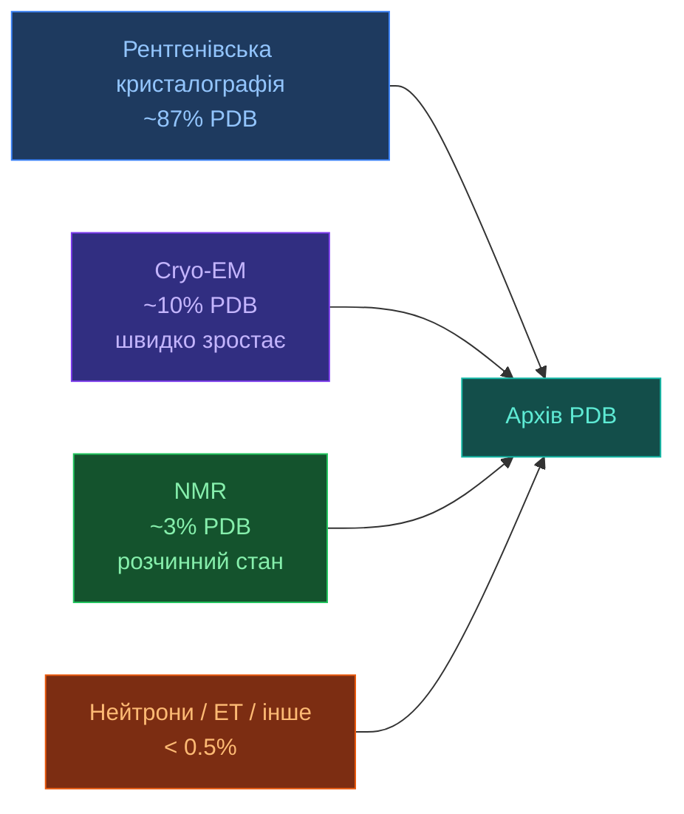

# 4.1. PDB

[[UA/Головна]] > [[UA/4. Датасети/4.0. Огляд датасетів|Датасети]] > PDB
🇬🇧 [[EN/4. Datasets/4.1. PDB|English]]

> Protein Data Bank (1971) — єдиний у світі репозиторій експериментально визначених 3D-структур біомакромолекул. Станом на 2025 рік містить понад **220 000 структур**.

---

## Масштаб і покриття

| Показник | Значення (2025) |
|---|---|
| Загальна кількість структур | ~220 000 |
| Унікальні білки (mapped до UniProt) | ~60 000 |
| Структури з лігандами | ~160 000 |
| Структури з нуклеїновими кислотами | ~12 000 |
| Нові депозиції на рік | ~15 000 |
| Основний формат | mmCIF (legacy: PDB) |

## Експериментальні методи

| Метод | Діапазон роздільної здатності | Переваги | Недоліки |
|---|---|---|---|
| Рентгенівська кристалографія | 0.5–3.5 Å | Висока роздільна здатність, позиції лігандів | Потрібен кристал, статичний знімок |
| Cryo-EM | 1.5–6 Å | Великі комплекси, без кристала | Нижча роздільна здатність для малих білків |
| NMR | N/A (дистанційні обмеження) | Динаміка в розчині, гнучкі ділянки | Ліміт розміру ~50 кДа |

## Роль у навчанні AlphaFold

AF2 та AF3 використовують PDB як основне джерело **ground truth структур** для supervised навчання:

| Використання | Деталі |
|---|---|
| Навчальна вибірка | Структури PDB з роздільною здатністю ≤ 3.5 Å |
| Валідаційна вибірка | Структури, депоновані після дати відсічки навчання |
| Пошук шаблонів | HHsearch проти PDB70 (репрезентативна підмножина) |
| Бібліотека лігандів CCD | Chemical Component Dictionary — визначає всі ліганди PDB |
| MSA шаблони | Структурні вирівнювання через HHblits/HHsearch |

Дата відсічки навчання AF3: **2021-09-30**. Структури, депоновані після цієї дати — невидимі тестові приклади.

## Якість даних

| Проблема | Вплив | Вирішення |
|---|---|---|
| Упередженість роздільної здатності | Низькоякісні структури вносять шум у координати | Фільтр ≤ 3.5 Å для навчання |
| Кристалографічні артефакти | Пакування кристала спотворює петлі/термінуси | Кілька ланцюгів, усереднення |
| Відсутні залишки | Гнучкі ділянки часто відсутні в густині | Маскування або de novo передбачення |
| Неповнота лігандів | Деякі ліганди змодельовані погано або відсутні | CCD + PoseBusters |
| Надлишковість | Багато майже ідентичних структур | Кластеризація за 30–70% ідентичності |

## Переваги vs обмеження

| Переваги | Обмеження |
|---|---|
| Єдине джерело експериментального ground truth | Упередженість до стабільних кристалізованих білків |
| Покриває білки, ДНК, РНК, ліганди, іони | Недостатнє покриття мембранних білків і IDP |
| Відкритий доступ, стандартизовані формати | Legacy PDB формат має відомі обмеження |
| Активна курація (звіти валідації) | Якість депозиції сильно варіює |
| Зв'язаний з UniProt, GO, EC-номерами | Обмежені часово-розвязані / динамічні дані |

---

> RCSB PDB: [https://www.rcsb.org](https://www.rcsb.org)
> PDBe (EBI): [https://www.ebi.ac.uk/pdbe](https://www.ebi.ac.uk/pdbe)
> Berman et al. (2000). *The Protein Data Bank*. Nucleic Acids Research, 28(1), 235–242.
