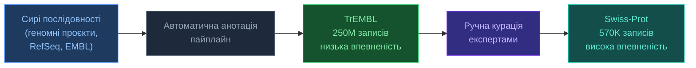

# 4.2. UniProt

[[UA/Головна]] > [[UA/4. Датасети/4.0. Огляд датасетів|Датасети]] > UniProt
🇬🇧 [[EN/4. Datasets/4.2. UniProt|English]]

> UniProt (2002) — центральний хаб для білкових послідовностей та функціональної анотації. Об'єднує Swiss-Prot (ручна курація) і TrEMBL (автоматична анотація).

---

## Масштаб і покриття

| Показник | Значення (2025) |
| --- | --- |
| UniProtKB/Swiss-Prot (curated) | ~570 000 записів |
| UniProtKB/TrEMBL (automated) | ~250 000 000 записів |
| Покриті організми | >1 000 000 |
| Зв'язані структури PDB | ~200 000 |
| API-запитів на день | ~100 000 000 |

## Swiss-Prot vs TrEMBL

| Ознака | Swiss-Prot | TrEMBL |
| --- | --- | --- |
| Курація | Ручна, експертами | Автоматичні правила |
| Якість анотації | Висока | Варіює |
| Розмір | ~570K | ~250M |
| Функціональні дані | Повні GO, EC, шляхи | Часткові |
| Частота оновлення | Безперервна | З кожним релізом UniProt |

## Роль у пайплайнах AlphaFold

| Використання | Деталі |
| --- | --- |
| Вхід послідовності | UniProt FASTA як основне джерело послідовностей |
| Побудова MSA | UniRef90/UniRef50 для HHblits і Jackhmmer |
| Функціональний контекст | GO-терміни, EC-номери для інтерпретації передбачень |
| Запуски в масштабі протеомів | Завантаження повного FASTA протеому для пакетного передбачення |
| Перехресні посилання | PDB ↔ UniProt ↔ Ensembl |

Кластери UniRef у MSA-пошуку AF:

| База | Кластеризація | Розмір | Використання |
| --- | --- | --- | --- |
| UniRef100 | Без кластеризації | ~300M | Пошук сирих гомологів |
| UniRef90 | 90% ідентичності | ~150M | Основний пошук HHblits |
| UniRef50 | 50% ідентичності | ~60M | Пошук дальніх гомологів |

## Переваги vs обмеження

| Переваги | Обмеження |
| --- | --- |
| Найповніший ресурс білкових послідовностей | Якість TrEMBL сильно варіює |
| Стабільні акцесійні ID (напр. P04637) | Swiss-Prot покриває лише ~0.2% відомих послідовностей |
| Багаті перехресні посилання (PDB, GO, KEGG) | Затримка анотації для нещодавно секвенованих організмів |
| REST API + програмне завантаження FASTA | Деякі записи мають суперечливі анотації |
| Кластери UniRef для ефективного MSA-пошуку | Ізоформи та варіанти потребують обережної обробки |

---

> UniProt Consortium (2023). *UniProt: the Universal Protein Knowledgebase in 2023*. Nucleic Acids Research, 51(D1), D523–D531.
> UniProt: [https://www.uniprot.org](https://www.uniprot.org)
