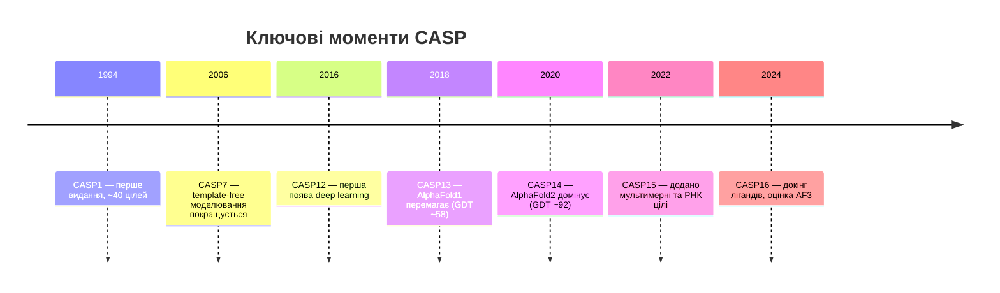

# 4.4. CASP

[[UA/Головна]] > [[UA/4. Датасети/4.0. Огляд датасетів|Датасети]] > CASP
🇬🇧 [[EN/4. Datasets/4.4. CASP|English]]

> CASP (Critical Assessment of Structure Prediction, 1994–дотепер) — золотий стандарт сліпого бенчмарку для передбачення структур білків. Цілі приховуються до подачі передбачень — це гарантує неупереджену оцінку.

---

## Видання CASP і ключові етапи

| Видання | Рік | Ключовий результат |
| --- | --- | --- |
| CASP13 | 2018 | AlphaFold1 — медіана GDT ~58, перша велика перемога DL |
| CASP14 | 2020 | AlphaFold2 — медіана GDT **92.4**, задача вирішена |
| CASP15 | 2022 | Мультимерні цілі, РНК, фокус на інтерфейсах |
| CASP16 | 2024 | Докінг лігандів, білок-нуклеїнові комплекси |

## Метрики оцінки у CASP

| Метрика | Вимірює | Діапазон | Хороший поріг |
| --- | --- | --- | --- |
| GDT_TS | Global Distance Test (% Cα в межах 1/2/4/8 Å) | 0–100 | > 90 відмінно |
| TM-score | Template Modeling score (топологія) | 0–1 | > 0.5 та сама згортка |
| RMSD | Root Mean Square Deviation (Cα) | 0–∞ Å | < 2 Å добре |
| lDDT | Local Distance Difference Test | 0–100 | > 90 висока якість |
| DockQ | Якість інтерфейсу для комплексів | 0–1 | > 0.23 прийнятно |

## Категорії цілей

| Категорія | Опис | Приклади цілей |
| --- | --- | --- |
| TBM | Template-based modeling (існує гомолог) | Глобулярні білки з шаблонами PDB |
| FM | Free modeling (без гомологів) | Нові згортки, de novo дизайн |
| TBM-hard | Важкі шаблони, дальні гомологи | Низька ідентичність послідовності (<30%) |
| Multimer | Білкові комплекси | Гомо/гетеродимери, асамблеї |
| RNA | Передбачення структури РНК | Додано у CASP15 |
| Ligand | Докінг лігандів у передбачені структури | Додано у CASP16 |

## CASP vs CAMEO

| Аспект | CASP | CAMEO |
| --- | --- | --- |
| Частота | Раз на 2 роки | Безперервно (щотижня) |
| Джерело цілей | PDB до публікації | Нові депозиції PDB |
| Сліпа оцінка | ✓ строга | ✓ автоматизована |
| Кількість цілей | ~100–150 на видання | ~тисячі на рік |
| Участь | Активний період подачі | Повністю автоматизований сервер |
| Фокус | Передові методи | Реальна продуктивність серверів |

## Переваги vs обмеження

| Переваги | Обмеження |
| --- | --- |
| Справді сліпа оцінка | Нечасто (раз на 2 роки) |
| Галузевий стандарт, широко цитується | Невеликий набір цілей (~100–150) |
| Експертні оцінювачі по кожній категорії | Упередженість до білків, придатних для PDB |
| Охоплює різноманітні класи цілей | Мембранні білки представлені слабко |
| Архів результатів з 1994 року | Затримка оцінки — результати через місяці після подачі |

---

> Moult et al. (2023). *Critical assessment of methods of protein structure prediction (CASP) — Round XV*. Proteins, 91(12), 1539–1556.
> CASP: [https://predictioncenter.org](https://predictioncenter.org)
