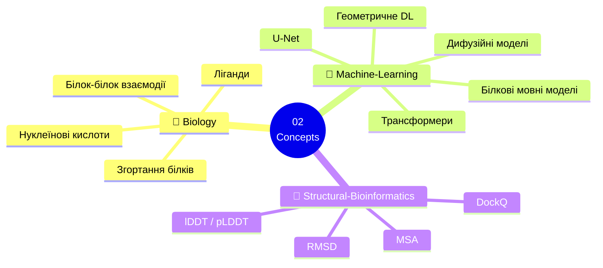
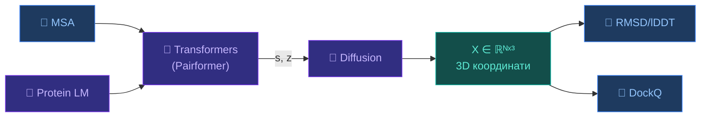

# 🧠 02 — Концепції

[[UA/Головна]] | 🇬🇧 [[EN/Index|English]]

Тематичний довідник: фундаментальні поняття біології, ML та структурної біоінформатики в основі AlphaFold 3.

## Cross-Domain Navigation

| Розділ | Точка входу | Навіщо це потрібно |
|---|---|---|
| Ядро AlphaFold 3 | [[UA/1. AlphaFold3/1.2. Архітектура/1.2.1. Загальна архітектура AF3]] | Головна архітектура, навчання, confidence і обмеження |
| Моделі | [[UA/3. Моделі/3.0. Огляд моделей]] | Порівняння `AF2`, `AF3`, `RoseTTAFold`, `ESMFold`, `DiffDock`, `OpenFold`, `Boltz-1`, `Chai-1`, `RoseTTAFoldNA` |
| Датасети | [[UA/4. Датасети/4.0. Огляд датасетів]] | Тренувальні дані, sequence resources і evaluation benchmarks |
| Література | [[UA/Література та пріоритети]] | Поточний reading list і прогалини покриття |
| Технічний digest | [[EN/Summary]] | Короткий implementation-oriented підсумок |

---

---

## 🧬 Biology

| Тема | Ключові поняття | Зв'язок з AF3 |
|------|-----------------|---------------|
| [[UA/2. Концепції/2.1. Біологія/2.1.1. Згортання білків]] | Levinthal, воронка, вторинна структура | AF3 генерує координати напряму |
| [[UA/2. Концепції/2.1. Біологія/2.1.2. Білок-білок взаємодії]] | BSA, ΔG_bind, інтерфейс, ipTM | AF3 → 76.6% DockQ high |
| [[UA/2. Концепції/2.1. Біологія/2.1.3. Ліганди та малі молекули]] | K_d, Ro5, кишеня, докінг | AF3 → 76.4% PoseBusters |
| [[UA/2. Концепції/2.1. Біологія/2.1.4. Нуклеїнові кислоти]] | ДНК/РНК структура, мотиви | AF3 — перша генеральна модель |

## 🤖 Machine Learning

| Тема | Ключові поняття | Зв'язок з AF3 |
|------|-----------------|---------------|
| [[UA/2. Концепції/2.2. Машинне-Навчання/2.2.1. Трансформери]] | MHA, Pairformer, IPA, SE(3) | Pairformer = 48 блоків |
| [[UA/2. Концепції/2.2. Машинне-Навчання/2.2.2. Дифузійні моделі]] | DDPM, DDIM, Score SDE | → [[UA/1. AlphaFold3/1.2. Архітектура/1.2.4. Дифузійні моделі — теорія та застосування]] |
| [[UA/2. Концепції/2.2. Машинне-Навчання/2.2.3. Білкові мовні моделі]] | ESM-2, MLM, embeddings | Input embedder у AF3 |
| [[UA/2. Концепції/2.2. Машинне-Навчання/2.2.4. Геометричне глибоке навчання]] | E(3)/SE(3), EGNN, еквіваріантність | IPA у diffusion module |
| [[UA/2. Концепції/2.2. Машинне-Навчання/2.2.5. ResNet]] | residual block, skip connections, bottleneck | Принцип residual updates важливий для стабільного навчання глибоких trunk-модулів |
| [[UA/2. Концепції/2.2. Машинне-Навчання/2.2.6. U-Net]] | encoder-decoder, skip connections, dense prediction | U-Net важливий як базовий шаблон для segmentation і багатьох diffusion backbones |

## 📐 Structural Bioinformatics

| Тема | Формула | Поріг |
|------|---------|-------|
| [[UA/2. Концепції/2.3. Структурна-Біоінформатика/2.3.1. RMSD]] | $\sqrt{\tfrac{1}{N}\sum\|r_i^\text{pred}-r_i^\text{true}\|^2}$ | < 2 Å ✅ |
| [[UA/2. Концепції/2.3. Структурна-Біоінформатика/2.3.2. lDDT]] | Збережені контакти при 4 порогах | > 90 ✅, < 50 ⚠️ |
| [[UA/2. Концепції/2.3. Структурна-Біоінформатика/2.3.3. DockQ]] | $(f_\text{nat} + f_\text{iRMSD} + f_\text{LRMSD})/3$ | > 0.8 ✅ |
| [[UA/2. Концепції/2.3. Структурна-Біоінформатика/2.3.4. MSA]] | Вирівнювання + коеволюція | $N_\text{eff} > 100$ |

## Від концептів до практики

| Практична тема | Найрелевантніший концептуальний шар | Основні нотатки |
|---|---|---|
| Загальне multimolecular prediction | Трансформери + diffusion + нуклеїнові кислоти | [[UA/3. Моделі/3.2. AlphaFold3]], [[UA/2. Концепції/2.2. Машинне-Навчання/2.2.1. Трансформери]], [[UA/2. Концепції/2.2. Машинне-Навчання/2.2.2. Дифузійні моделі]] |
| Open `AF2` engineering | Трансформери + MSA | [[UA/3. Моделі/3.6. OpenFold]], [[UA/2. Концепції/2.3. Структурна-Біоінформатика/2.3.4. MSA]] |
| Open `AF3`-like local workflows | Protein language models + diffusion + complex evaluation | [[UA/3. Моделі/3.7. Boltz-1]], [[UA/3. Моделі/3.8. Chai-1]], [[UA/2. Концепції/2.2. Машинне-Навчання/2.2.3. Білкові мовні моделі]], [[UA/2. Концепції/2.3. Структурна-Біоінформатика/2.3.3. DockQ]] |
| Комплекси protein–DNA / protein–RNA | Нуклеїнові кислоти + interface metrics | [[UA/3. Моделі/3.9. RoseTTAFoldNA]], [[UA/2. Концепції/2.1. Біологія/2.1.4. Нуклеїнові кислоти]], [[UA/2. Концепції/2.3. Структурна-Біоінформатика/2.3.2. lDDT]] |
| Structure search після передбачення | Метрики структурної біоінформатики | [[UA/1. AlphaFold3/1.5. Ресурси/1.5.7. Foldseek і пошук структур]], [[UA/2. Концепції/2.3. Структурна-Біоінформатика/2.3.1. RMSD]], [[UA/2. Концепції/2.3. Структурна-Біоінформатика/2.3.2. lDDT]] |

---

## 🔗 Концепти → AF3

